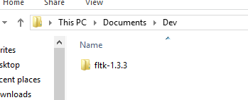
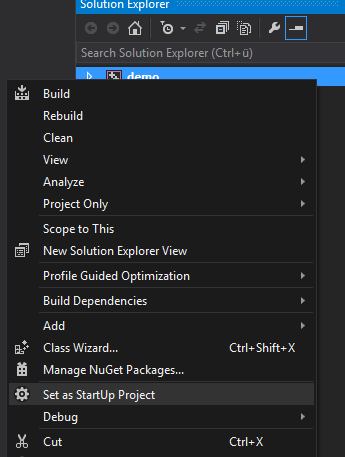
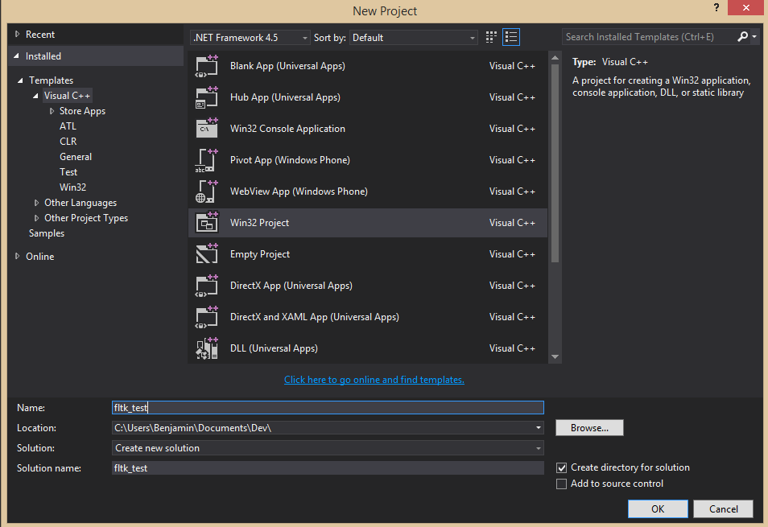
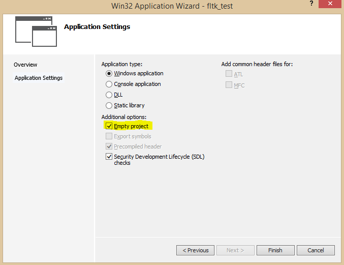
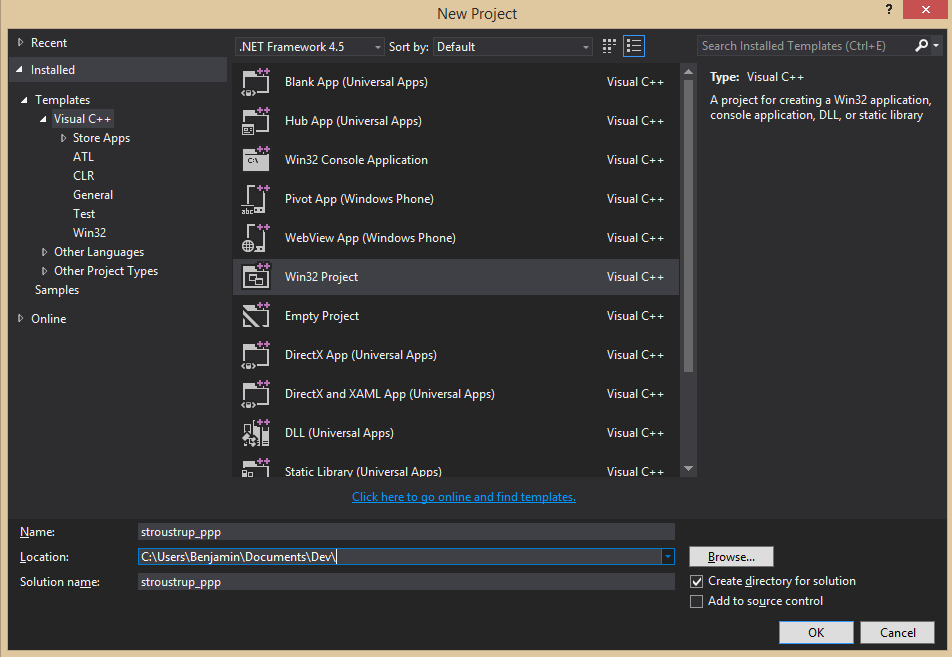
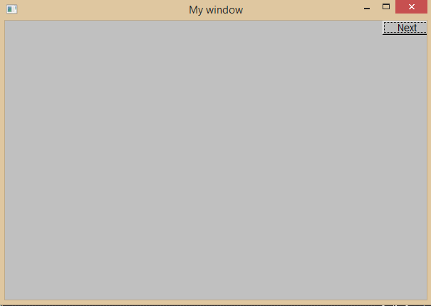

# Installing FLTK 1.3.3 under Visual Studio Community 2013

*Before starting to read this: Phil has written [an updated version][post-phil]
of this guide, using FLTK 1.3.4 and Visual Studio 2017. You should probably
head over there.*

[post-phil]: https://bumpyroadtocode.com/2017/08/29/how-to-install

## Downloading and building FLTK

Download FLTK from [here][ftlk]: get `fltk-1.3.3-source.tar.gz` and decompress
it, using for example [7-Zip][7zip]. You should end up with a directory
`fltk-1.3.3`; I have put mine in a subfolder of my `Documents` folder:

[fltk]: http://www.fltk.org/software.php
[7zip]: http://www.7-zip.org



Now open the project file `fltk.sln` in `fltk-1.3.3/ide/VisualC2010`. If asked,
say you're okay with updating the project files.

Make sure you have selected *Debug* as your solution configuration.


In the context menu of the *demo* project, select *Set as StartUp Project*.



Now build the solution (*Build* -- *Build Solution* or <kbd>Ctrl</kbd> +
<kbd>Shift</kbd> + <kbd>B</kbd>). If successful, you should be able to run the
*demo* project (*Debug* -- *Start Debugging* or <kbd>F5</kbd>).

Change the solution configuration to *Release* and build again. Check if you
can run the *demo* project (<kbd>F5</kbd>).

Now we have to copy the generated library files to the right directory so
Visual Studio finds them. In my installation, the libraries and headers are in
`C:\Program Files (x86)\Microsoft Visual Studio 12.0\VC` (just `VC` from now
on). If you have the right directory, there should be a bunch of
subdirectories:


Now copy (don't move) the following from you `fltk-1.3.3` folder:

- The complete `FL` directory to `VC\include`

- All `.lib` files from `fltk-1.3.3\lib` (except `README.lib`) to `VC\lib`.
  There should be 14 files: seven pairs of two files each, one of which has an
  added "d" (for "debug") at the end of the file name.

- `fluid.exe` and `fluidd.exe` from `fltk-1.3.3\fluid` to `VC\bin`

## Setting up a FLTK project

To set up a FLTK project, select *File* -- *New* -- *Project* and choose *Win32
Project*:



In the wizard under *Application Settings*, check *Empty project*:



Create a source file with *Project* -- *Add New Item*:


Enter this code:

```cpp
#include<FL/Fl.H>
#include<FL/Fl_Box.H>
#include<FL/Fl_Window.H>

int main()
{
    Fl_Window window(200,200,"Window title");
    Fl_Box box(0,0,200,200,"Hey, I mean, Hello, World!");
    window.show();
    return Fl::run();
}
```

Now open *Project* -- *Properties* and make sure you have selected *Debug* in
*Configuration* in the top left corner. Under *Linker* -- *Input*, edit
*Additional Dependencies* and add `fltkd.lib`, `wsock32.lib`, `comctl32.lib`,
`fltkjpegd.lib` and `fltkimagesd.lib`, each on their own line:


Because this is the *Debug* configuration, we would like to have a visible
console window. To get that, go to *Linker* -- *System* and set
`/SUBSYSTEM:CONSOLE` for *SubSystem*:


Now build and run the project. You should get a console window and the GUI
window:


Now go back to *Project* -- *Properties* and select *Release* as the
configuration. Go to *Linker* -- *Input* and edit the *Additional Dependencies*
just like before, but this time, add `fltk.lib`, `wsock32.lib`, `comctl32.lib`,
`fltkjpeg.lib` and `fltkimages.lib`---notice the missing `d` at the end of the
names:


Make sure that under *Linker* -- *System*, the option `/SUBSYSTEM:WINDOWS` is
selected so we don't get a console window. Now build and run to see if only the
GUI window shows up.

That's how you set up any project using FLTK!

## Getting FLTK with headers from Stroustrup's book to run

A lot of people struggling with FLTK are using it in the first place because
they're working through Bjarne Stroustrup's book "[Programming---Principles and
Practice Using C++][ppp]", which uses FLTK in its Chapters 12 to 16 for GUI
examples. Stroustrup provides a small interface library to be used in all the
exercises. Here is how to set up a project using this interface library!

[ppp]: http://www.stroustrup.com/Programming/

Create a new Win32 project. I've called mine `stroustrup_ppp`:



Make sure it's empty by selecting *Empty project* in *Application Settings* in
the Application Wizard.

Now set all the project properties just like above so Visual Studio properly
links to the FLTK library files.

For the example, we're going to do the drill of Chapter 12. Select *Project* --
*Add New Item* to add a new file:


If you haven't already, download the [standard library access header][header]
and the [GUI support code][guisupport] from the [website][ppp] and put them in
the same directory as `chapter12_drill.cpp`. Ignore all the matrix files and
`Gui.h`---download `GUI.h`. Don't download `simple_window.cpp` as everything is
already defined in `simple_window.h`. The directory should look like this
afterwards:

[header]: http://www.stroustrup.com/Programming/PPP2code/std_lib_facilities.h
[guisupport]: http://www.stroustrup.com/Programming/PPP2code/


Now add all the files to the project using *Project* -- *Add Existing Item*:


This is actually overkill as we're not going to use `GUI.h` and `GUI.cpp` for a
while, but you won't have to add anything else when you eventually use them.

For some reason, in `Point.h`, the constructors are commented out. Uncomment
everything in the struct.

Now edit `chapter12_drill.cpp` and enter this code:

```cpp
#include "Graph.h"
#include "Simple_window.h"

int main()
{
    using namespace Graph_lib;

    Point tl(150,150);
    Simple_window win(tl,600,400,"My window");
    win.wait_for_button();
}
```

If you try to build your solution now, you get a slew of errors. Here is how to
get rid of them:

In `std_lib_facilities.h`, comment out the complete `vector` part:


This should get rid of errors related to `vector` and initializer lists; you
lose range checking, though.

Next, because [list initialization inside member initializer list or non-static
data member initializer is not implemented][msdn] in VS 2013, comment out the
constructor of `Lines` in `graph.h` (line 238). For the same reason, replace
the constructor of `Text`:

[msdn]: http://msdn.microsoft.com/en-us/library/dn793970.aspx


Next, in `GUI.cpp`, add `Graph_lib::` in front of `Window&` in the definition
of `Button::attach` (line 8), `In_box::attach` (line 30) and `Out_box::attach`
(line 49). In `Graph.cpp`, in the definition of `can_open`, replace `return
ff;` with `return bool(ff);` (line 319).

Finally, in `GUI.cpp`, remove the constructor `Menu::Menu` as it is already
defined in `GUI.h`.

Now you should be able to build and run the project!


