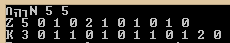
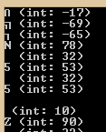
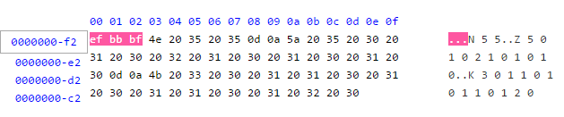
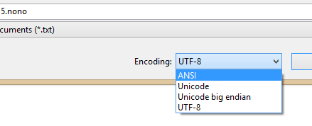
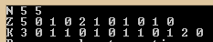

# The mysterious byte order mark

I bumped into a strange problem with reading a text file recently. The file
described the layout of a [Nonogram][nonogram] for a program my father was
working on:

[nonogram]: http://en.wikipedia.org/wiki/Nonogram

```txt
N 5 5
Z 5 0 1 0 2 1 0 1 0 1 0
K 3 0 1 1 0 1 0 1 1 0 1 2 0
```

And to read the first line, he used something like this:

```cpp
char ch;
int i1;
int i2;
ifstream ifs("Goobix 5.nono");
ifs >> ch >> i1 >> i2;
```

However, this didn't work, the `int`s didn't get read successfully. I then tried

```cpp
char ch;
ifstream ifs("Goobix 5.nono");
while (ifs.get(ch))
    cout << ch;
```

to not ignore whitespace, resulting in this:



Behold, three unwanted characters! What are they? Let's cast them to `int` to
find out more:

```cpp
char ch;
ifstream ifs("Goobix 5.nono");
while (ifs.get(ch))
    cout << ch << " (int: " << int(ch) << ")\n";
```

and we get



Negative, eh? Strange. [Other people have seen similar things][soquestion], so
apparently these aren't normal ASCII characters. To find out more, I've looked
at the text file with a hex editor:

[soquestion]: https://stackoverflow.com/q/4690415/3266847



The file starts with `0xef 0xbb 0xbf`. That's googleable! and leads to [byte
order marks][bom] (BOM). The BOM indicates endianness and encoding of the text
file; in the case of `0xef 0xbb 0xbf`, it is a UTF-8 encoded file. To get rid
of the BOM, we can just save the file with ANSI encoding:

[bom]: http://en.wikipedia.org/wiki/Byte_order_mark



Now, the file behaves as expected when being read:



Encodings in C++ (and elsewhere!) can be daunting. Good readings I have found
include these:

- [The Absolute Minimum Every Software Developer Absolutely, Positively Must
  Know About Unicode and Character Sets (No Excuses!)][joelunicode] by Joel
  Spolsky

- [Character Encodings For Modern Programmers][gatunka] by GT

- And, one day, should I have lots of spare time: [Standard C++ IOStreams and
  Locales][langer] by Angelika Langer and Klaus Kreft

[joelunicode]: http://www.joelonsoftware.com/articles/Unicode.html
[gatunka]:     http://blog.gatunka.com/2014/04/25/character-encodings-for-modern-programmers/
[langer]:      http://amzn.com/0201183951

*Edit (February 2, 2015):* Since I've written this, I've read [Dive Into Python
3][dip3] by Mark Pilgrim, and the [chapter about strings][strings] has made
encodings so much clearer to me, so it is most recommended reading.

[dip3]:    https://www.diveinto.org/python3/table-of-contents.html
[strings]: https://www.diveinto.org/python3/strings.html
