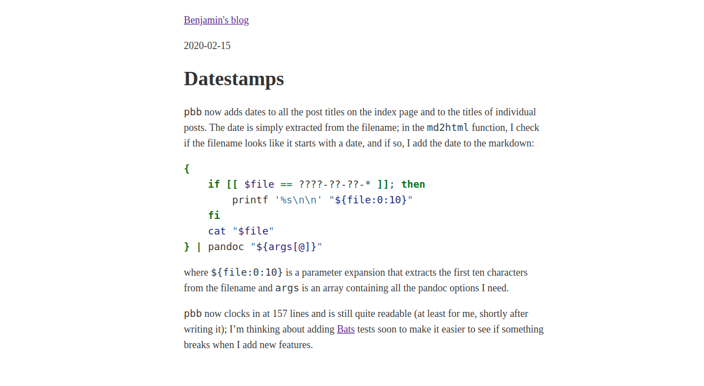

# Pbb is now pretty

`pbb` is now producing something that's not quite as much saying "90s HTML" any
longer. I took some inspiration from the "satire" (debatable) websites that
started with the [mothereffing website][1][^1]. I'd say the original `pbb`
output was very close to that (i.e., no styling at all), but thanks to sane
pandoc defaults, it didn't even look all that bad, also on mobile devices. Only
the super long lines weren't all that great on bigger displays.


[1]: https://motherfuckingwebsite.com
[^1]: Got to keep the SEO juice for these terms reasonably low.

As it turns out, the m-effing website inspired a whole slew of improvements,
each more assertive than the other: [better][2], [even better][3], [best][4],
[*the* best][5], [perfect][6], and (unoriginally) [another *the* best][7] one.

[2]: http://bettermotherfuckingwebsite.com
[3]: https://evenbettermotherfucking.website
[4]: https://bestmotherfucking.website
[5]: https://thebestmotherfucking.website
[6]: https://perfectmotherfuckingwebsite.com
[7]: https://thebestmotherfuckingwebsite.co

There's even one of these "awesome" lists [on GitHub][8], and from there, I
found a [paper][9] about the original one. Academic and all.

[8]: https://github.com/lyoshenka/awesome-motherfucking-website
[9]: https://link.springer.com/chapter/10.1007/978-3-319-08245-5_44

The different improvements revolve mostly around styling, security,
accessibility and the like, but the overall idea stays the same. I took the
styling of the first better one and tweaked it a tiny little bit:

```css
body {
    color: #333;
    font-size: 18px;
    line-height: 1.6;
    margin: 40px auto;
    max-width: 650px;
    padding: 0 10px;
}

h1, h2, h3 {
    line-height:1.2;
}

img {
    max-width: 100%;
}
```

I didnt know that there's a whole [war][10] out there regarding contrast and if
it is bad or not. I settled on the same dark grey as the New York Times uses.
They probably know how to do this.

[10]: https://contrastrebellion.com

The other change I did was for images, to prevent that they'd be wider than the
text column.

All in all, the result looks like this (on the date this post was written):



I'll look into a nicer font and different styling for links, but other than
that, I feel like that's a pretty good ROI. Well, the font in code block feels
a bit large now. Still. Good ROI.
