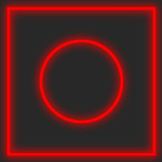

# Bloom effect in ImageMagick

I bumped into an [article][1] today about "Bloom effect in Go". It describes
how to get that effect by drawing, blurring, and drawing again, using a few Go
libraries, resulting in something like this:

[1]: https://remy.io/blog/bloom-effect-in-go


I thought "hey, I bet you can do that in ImageMagick, too![^1]" So I tried.
After a bit of fiddling, I arrived at this:

[^1]: That's probably true of many things, it's just more or less convenient.

```bash
convert -size 200x200 xc:'rgb(40,40,40)' \
    -stroke red -fill 'rgb(40,40,40)' -strokewidth 6 \
    -draw 'rectangle 10,10 190,190' \
    -draw 'circle 100,100 100,50' \
    -gaussian-blur 20x5 \
    -fill none -strokewidth 3 \
    -draw 'rectangle 10,10 190,190' \
    -draw 'circle 100,100 100,50' \
    bloom.png
```

And the result isn't too far away, either:



So, if I ever have to draw lots of circles and squares and blur them a bit, I'm
now all set for automating that.
