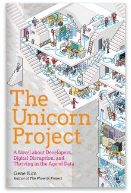

# Book review: The Unicorn Project

[*The Unicorn Project*][1] (TUP from here on) was our most recent "project" in
the book club at work. It was my suggestion, I had preordered it when I first
saw it, and I had very high hopes for it – [*The Phoenix Project*][2] (TPP) had
been our first book club book, and it was a big success, both in terms of being
interesting and drawing a good sized crowd to the book club meetings.

[1]: https://itrevolution.com/the-unicorn-project
[2]: https://itrevolution.com/book/the-phoenix-project

We even followed up TPP with [*Accelerate*][3], and I'm pretty sure the overall
awareness of the importance (or existence?) of DevOps at the company improved
as a consequence.

[3]: https://itrevolution.com/book/accelerate

TUP, however, didn't quite live up to the great expectations we had. This
manifested itself in a group size that was down to the size of three by the
time we finished, from an initial count of about ten. And it wasn't because the
book was dense or a difficult read, that much is for sure.

Quite the opposite, actually. Sure, TPP had fluff, but it was entertaining
fluff, and there was a core with quite some substance to it: The Three Ways,
and a long list of interesting references to get deeper into the topic. TUP, on
the other hand, turned out to be almost exclusively fluff. Yes, there were The
Five Ideals, and I'm not sure why they seemed so much less insightful than The
Three Ways, but I had this strong sense of "duh, that's obvious" for much of
the time.

Functional programming is presented as the cure-all for software engineering
that probably is going to make Fred Brooks rewrite his [famous essay][4] any
moment now. When the story's heroine Maxine sits down and rewrites that pesky
2000 line "order fulfillment module" over her lunch break in Clojure – after
having fixed it in a single morning first, no less – the eyeroll is certainly
strong in me.

[4]: http://faculty.salisbury.edu/~xswang/Research/Papers/SERelated/no-silver-bullet.pdf

If I wanted to be mean, I'd say the book is a 300 page prelude to a list of
references containing the meaty stuff. But that wouldn't be quite fair. I feel
the book has entertainment value even without being super insightful or
instructive, and there really aren't that many novels written about software
engineering that dont' go overboard with the clichés. Not that TUP doesn't have
a few, uh, "stereotpyical" personalities – but all in all, it feels like it's
written by somebody who knows what they're talking about, and I don't feel like
my time reading it was wasted.

Even if Clojure isn't going to cure cancer.
