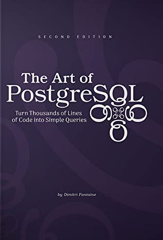
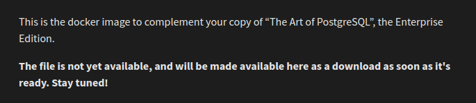

# Book review: The Art of PostgreSQL

A few months ago, we set up a "SQL book club" at work and tackled [*The Art of
PostgreSQL*] by Dimitri Fontaine as our first book. Here's what I thought about
it.



  [*The Art of PostgreSQL*]: https://theartofpostgresql.com/

## The good

Even though working through a technical book isn't all that much fun, I've been
able to stick to a "one part per two weeks" schedule (mostly because of the
peer pressure in the form of an upcoming book club meeting). The book clocks in
at about 430 pages, spread over eight parts with 51 chapters total. Reading one
part and following along with the examples took be about three hours or so per
part; we started in December and finished last week.

I've definitely learned a lot. Enough for a separate post, actually; I've taken
notes for all chapters and want to polish and publish them, if only as
a resource for my future self.

The book's tag line is

> Turn Thousands of Lines of Code into Simple Queries

and I'm definitely more aware of things we could do using Postgres instead of
application code.

The book is pretty complete in the sense that it starts from queries that just
read data, goes on to data modelling and ends up with data manipulation and
Postgres extensions. It is *not* a book about learning to write queries, but
working through all the examples certainly helps by way of exposure to
presumably well-written queries.

Throughout the book, I had lots of small "a-ha!" moments when an example used a
handy string function or some other functionality I hadn't been aware of but
could immediately start using; the chapter about setting up `psql` inspired me
to work through the complete [documentation] for it and definitely improved my
efficiency.

  [documentation]: https://www.postgresql.org/docs/current/app-psql.html

## The bad

### Price

The book is expensive! There are four editions:

- "Standard" for \$49 with the electronic version (PDF, EPUB and MOBI) and all
  the queries as `.sql` files
- "Full" for \$99, with additionally a DB dump to load
- "Dead Tree" for \$129, with additionally the printed book
- "Enterprise" for \$229, which is like the Full Edition, but for 15 people and
  including a Docker container (but see [below](#the-docker-container))

I pre-ordered the Full Edition for \$69, if I remember correctly, which is
still pretty steep, and work purchased the Enterprise Edition for the book
club.

### The distribution platform is weird

The book and data download takes place on Thinkific, a platform that seems to
be meant for online courses, but all the features just get in the way of
quickly downloading the files: I have to "start" or "replay" a "course" to get
them. And I swear it aggressively messed up my password multiple times.

### Sloppiness

I might be overly sensitive to typos, but if I pay a lot of money for a book,
I kind of expect some level of quality control, and not the outlook to Part
3 to mention "*Writting* SQL queries". There's a noticeable typo every few
pages, and in some places the sentences could have done with a little love from
a copy editor, leaving a not-so-great impression of "self published" overall,
which is at odds with the steep price.

### The data set

The full edition comes with a data set and a script to load it all, but
I definitely didn't manage to run that successfully. Loading individual files
was hit and miss, and I spent more than enough time just loading the example
data to follow along.

Some of the queries contain little bugs like referring to the wrong schema, but
those were fixed easily most of the time.

For some examples, the author only shows how he loads the publicly available
data using a Common Lisp script, and I didn't even try to get those examples
running. Too bad, because the queries on that data were about the most common
pub names near a city identified by an IP address, which is the best kind of
query.

### The Docker container

Part of the allure of the Enterprise edition is that it comes with a Docker
container; spin it up, and start playing around with the data immediately!
Great, isn't it?

Except, this:



The book has been out for a few months now; I don't think the sales pitch for
the Enterprise edition should even mention the Docker container if quite
clearly it's not there yet.

### The EPUB version is broken

I usually read my e-books with the Google Play Books reader, but it would
stubbornly refuse to recognize the file as a valid EPUB file. I emailed the
author about this, but I didn't get an answer; I also tried the chat function
on Thinkific, which could as well just not be there, as I didn't get any
response on there either[^1]. Booh.

### Indentation style

This one's really just my personal preference. I can live with this statement:

> we now have color screens and syntax highlighting and we don't write all-caps
code anymore... not even in SQL.

But the indentation advice to "right align top-level SQL clauses"... I could
just not warm up to that.

Here's how the author would write a simple query:

```sql
  select name, milliseconds
    from           album
         left join track using(albumid)
   where albumid = 1
order by trackid;
```

The whole thing starts with whitespace, and only on the last line can we see
that it's because `order by` is longer than `select`! The vertical separation
is not obvious to me. And aligning the table names in the `from`/`join` part
makes it look like there was an accident involving the space bar. I would write
this like

```sql
SELECT name, milliseconds
FROM album
    LEFT JOIN track USING (albumid)
WHERE albumid = 1
ORDER BY trackid;
```

But really, that's not a complaint about the book. I'm just saying that until a
team had agreed on a style for SQL, I'd try and nudge them away from the first
one.

[^1]: It seems that the chat function has since been removed. Makes sense.

### The interviews

Each part ends with an interview; I didn't get too much value out of them. Some
feel a bit too much like ads for Postgres, and I think a book about Postgres
probably wouldn't include an interview with somebody who's super critical of
it.

## Summary

I don't regret spending quite some time to work through this book; I've learned
a lot and will often come back to it to look up things I've forgotten the
specifics about but remember their existence (`JOIN LATERAL`, anybody?).

It's far from perfect, though, and I don't like being promised (and paying for)
things I don't get, such as a working EPUB version or the mythical Docker
container.

Let's call this 4 out of 5 for content, but 3 out of 5 taking price and
non-delivered features into account.
