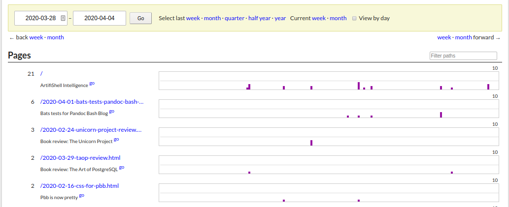

# GoatCounter: analytics for Pandoc Bash Blog

Is anybody even reading any of this? The question is only semi-important,
because half of the fun of building my own static site generator is actually
using it.

It would still be interesting to know, though. I don't really want to use
Google Analytics because a) it's total overkill and b) I like it when websites
reduce the amount of data they shovel to tech giants at least somewhat.

The proper answer is of course "roll your own", but I'm not hosting my website
myself currently.

Enter [GoatCounter]! It does everything I want, is very easy to integrate, and
part of the [rationale] for the project is to help "de-Google-fying" the
internet a little, which sounds like a good idea. Don't get me wrong, I use
Google for pretty much everything, but there should always be alternatives.

The project is very privacy minded and, as explained in the [privacy policy],
does not store any personal information about visitors. It is open source and
can be inspected on [GitHub].

Part of the project's philosophy is to provide a free tier for non-commercial
usage, which is pretty awesome. After trying it for a while, I liked it enough
to start [sponsoring] the author. I've actually come across Martin before: he
used to be quite active on Meta Stack Overflow, is the highest rep user on the
[Vi and Vim Beta Stack Exchange], and his [blog] regularly pops up on the front
page of Hacker News, which is where (I think) I've first heard of GoatCounter.

  [GoatCounter]: https://www.goatcounter.com/
  [rationale]: https://github.com/zgoat/goatcounter/blob/master/docs/rationale.markdown
  [privacy policy]: https://www.goatcounter.com/privacy
  [GitHub]: https://github.com/zgoat/goatcounter
  [sponsoring]: https://github.com/sponsors/arp242
  [Vi and Vim Beta Stack Exchange]: https://vi.stackexchange.com/
  [blog]: https://www.arp242.net/

## Yes

To answer the question from above: people *do* read what I write. (Or at least
visit the site.) Even if only in very modest numbers.

I wonder if the Bash testing framework [Bats] really is so interesting that my
[post] about using it to test pbb tops the list, or maybe another currently
ongoing and slightly bat-related event might be the reason for this
peculiarity.

  [Bats]: https://github.com/bats-core/bats-core
  [post]: 2020-04-01-bats-tests-pandoc-bash-blog.html

## A new subcommand for pbb

I'm using GoatCounter for my own site, but I also wanted to integrate it with
[Pandoc Bash Blog]. To this end, there is a new subcommand `pbb gccode` (as in
**G**oat**C**ounter **code**), which adds the site specific code into an HTML
snippet which, if the configuration setting for the code exists, gets added to
each page.

Adding something right before the `</body>` tag (which is where the GoatCounter
snippet goes) is directly supported by pandoc via the
`-A`/`--include-after-body` option. This means I didn't have to touch the HTML
template and can keep using the default; one day, I'll have to modify it, but
not quite yet.

  [Pandoc Bash Blog]: https://github.com/bewuethr/pandoc-bash-blog
