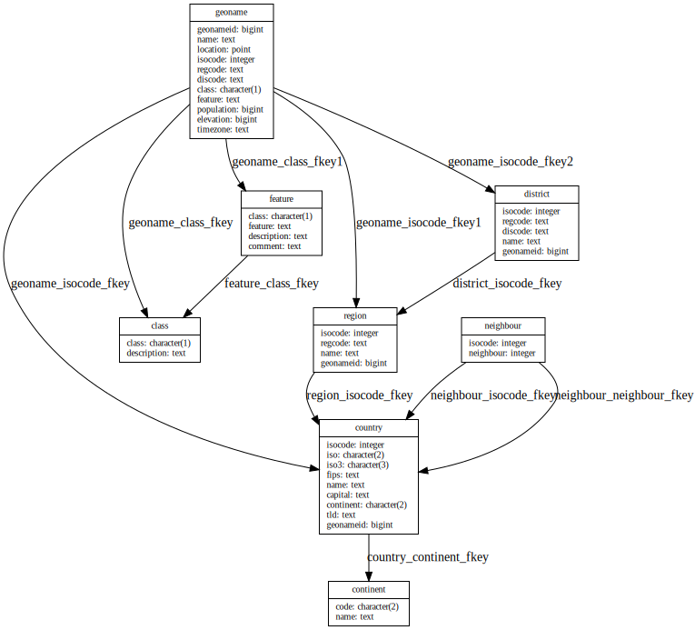

---
toc: true
...

# My summary of "The Art of PostgreSQL"

I've recently finished reading *The Art of PostgreSQL* (see my [review]).
I took a lot of notes, mostly to help me read in a more focused manner;
I thought it'd be nice to polish and publish them.

I first wanted to call this "What I've learned from TAOP", but it also includes
things I already knew, so there.

  [review]: 2020-03-29-taop-review.html

## Parts I and II: Preface and Introduction

I didn't take any notes for these---they're a very general introduction to the
book, a first application example, and why you should use Postgres. Got it.

## Part III: Writing SQL Queries

### Chapter 4: Business Logic

- Isolation levels (read uncommitted, read committed etc.); there's more about
  this later
- Stored procedure: `create or replace function`
- Lateral joins: iterate over each row of a result and evaluate sub-query with
  that row as a parameter, see [this article] and the "top-n artist by genre"
  query
- Prefer SQL for stored procedures over PLpgSQL

  [this article]: https://heap.io/blog/engineering/postgresqls-powerful-new-join-type-lateral

### Chapter 5: A Small Application

- Variables in psql:
  - Set with `\set n 1`
  - From the command line: `psql --variable 'n=1'` (or `--set` or `-v`)
  - Referred to using `:n`
- Python library that lets you store SQL queries in separate files: [anosql]
- `limit :n` seems to eat the blank, have to use `limit  :n` for some reason

  [anosql]: https://github.com/honza/anosql

### Chapter 6: The SQL REPL---An Interactive Setup

This chapter was great, I've totally overhauled my psql configuration file
after reading it and the whole [man page]. My favourites:

- Unicode border style: `\pset linestyle unicode`
- Flag for transaction in prompt: `%x` in the prompt string
- `\e` opens the last command in an editor!
- `-P format=html`, or `asciidoc`, `latex`, ...
- `\set ECHO_HIDDEN true` shows the queries run by slash commands

  [man page]: https://www.postgresql.org/docs/12/app-psql.html

### Chapter 7: SQL is Code

This chapter basically says that all the ususal software engineering practices
apply to SQL code as well: use a consistent style, use tests, use meaningful
names, and so on. The style guide promoted by the author is roughly

- Do not use uppercase SQL keywords because it's a leftover from ancient times
- Right-align top-level keywords
- Use meaningful names, for example to indicate the meaning of a table in
  a self-join:

    ```sqlpostgresql
    from      artist
         join track on track.name = artist.name
         join album on album.albumid = track.albumid
         join artist inspired on inspired.artistid = album.artistid
    ```

  That example also demonstrates the style in action, and until the end of the
  book, I could not get myself to like it.

Other advice:

- Use meaningful aliases, such as `artist` and `inspired` instead of `a1` and
  `a2`
- Unit testing for Postgres: [pgTAP]
- CLI tool to run tests: [pg\_prove]
- Tool for temp environments running tests: [pg\_virtualenv]
- Regression testing tool: [regresql]
- `application_name` parameter lets you specify who made a request

  [pgTAP]: https://pgtap.org
  [pg\_prove]: https://pgtap.org/pg_prove.html
  [pg\_virtualenv]: http://manpages.ubuntu.com/manpages/eoan/man1/pg_virtualenv.1.html
  [regresql]: https://github.com/dimitri/regresql

## Part IV: SQL Toolbox

### Chapter 13: Select, From, Where

- Shortcut for `select * from`: `table`
- `select *` is bad
- `format('%s %s', forename, surname)` instead of `||` concatenation
- Outer joins: restrictions in the `on` clause are processed *before* the join;
  restrictions in the `where` clause are processed *after* the join
- `generate_series` to, uh, generate a series
- *anti-join:* exclude rows that fail test, for example

    ```sqlpostgresql
    where not exists (select 1 from subquery)
    ```

### Chapter 14: Order By, Limit, No Offset

- `order by` with nulls last: `order by column nulls last`
- `order by` with complex condition:

    ```sqlpostgresql
    order by case when status = 'Power Unit' then 1 else 2 end
    ```

- `point(lng, lat)` and `<->` to get distance between points
- `extract(field from timestamp)` to get just one field out of a timestamp
- `offset` is bad, don't use it; it reads everything anyway, but then discards
  most of it; use index lookups instead:

    ```sqlpostgresql
          where raceid = 972
            and row(lap, position) > (1, 3)
       order by lap, position
    fetch first 3 rows only;
    ```

### Chapter 15: Group By, Having, With, Union All

- Compare a row to the previous row: `lag()` function, example:

    ```sqlpostgresql
    lag(nbraces, 1) over(order by decade)
    ```

- Syntax for aggregate filter: `filter(where ...)`

    ```sqlpostgresql
    count(*) filter(where position is null) as outs,
    ```

  I use this one all the time now!
- Filter groups: `having` clause; can't reference `select` output aliases!
- Grouping sets: group by multiple groups, as in

    ```sqlpostgresql
    group by grouping sets((drivers.surname),
                           (constructors.name))
    ```

- `group by rollup(...)`: creates permutations for each column in the grouping
  sets
- `group by cube(...)`: includes partial permutations
- *Common table expressions:* `with alias as (...)`
- Repeating strings: `repeat(string text, number int)`, e.g., build a histogram
  with

    ```sqlpostgresql
    repeat(text '■', 10)
    ```

- Can't nest aggregate queries, but you can chain common table expressions
- SQL alternative to PostgreSQL's `distinct on`: use `group by` without
  aggregates
- Set difference: `except` (useful for regression testing)

### Chapter 16: Understanding Nulls

- Any boolean comparison involving `null` has value `null`, even `null = null`
- `null` is "we don't know"
- "Pretend SQL doesn't implement three-valued logic": `is [not] distinct from`

### Chapter 17: Understanding Window Functions

I definitely still don't understand window functions.

- `over (order by x)` is short for

    ```sqlpostgresql
    over (order by x rows between unbounded preceding and current row)
    ```

- `over ()` sees the whole set of rows
- Window functions happen *after* the `where` clause
- `over (partition by column)` is a frame showing *peer rows* with the same
  value for `column`
- All aggregate functions can be used against a window frame
- The book got the fastest lap speed wrong; it's a velocity, not a time, so
  should be ordered like this:

    ```sqlpostgresql
    over(order by fastestlapspeed::numeric desc)
    ```

  The author even comments on how it's counterintuitive that the fastest lap
  seems to be almost inversely correlated to doing well in the race.

- Re-using a window definition:

    ```sqlpostgresql
    select surname,
           lag(code, 1) over w as "prev",
           lead(code, 1) over w as "next"
      from      results
           join drivers using(driverid)
     where raceid = 890
    window w as (order by position)
    ```

- Divide into groups: `ntile()` function

### Chapter 18: Understanding Relations and Joins

- A table is really a *relation*, and you can query the "composite data type":

    ```sqlpostgresql
    select relation from relation
    ```

- `create table` really creates a new data type

## Part V: Data Types

### Chapter 20: Serialization and Deserialization

Storing and retrieving values out of and back into memory isn't a problem for
which you need a database system.

### Chapter 21: Some Relational Theory

- A *tuple* is a list of attributes
- A *relation* is a list of tuples that all share the same list of attribute
  domains: *names* and *data type*
- There's a time literal called `allballs`, which is `00:00:00.00 UTC`
- There is a table that determines which function is run depending on the
  operand types on both sides of `=`
- You can add your own as extensions

### Chapter 22: PostgreSQL Data Types

Get a sample from a table: `tablesample`; for example:

```sqlpostgresql
select * from table tablesample bernoulli(10);
```

gets a sample where each row has a chance of 10% to appear in the output.

#### Boolean

- Aggregates for booleans: `bool_and`, `bool_or`
- Use `is`, not `=` for comparison to booleans
- Remember that nulls are skipped, so use `is [not] distinct from` when
  required

#### Character and Text

- Regular expression support with main operator `~`
- Split field into separate table: `regex_split_to_table`
- Split into array: `regex_split_to_array`
- There's lots of advanced support for documents, text search queries, ranking,
  highlighting etc.

#### Server Encoding and Client Encoding

- Never use `SQL_ASCII`
- If a client doesn't understand `UTF8`, you can have Postgres do conversion on
  the fly

#### Numbers

All combinations of operand types have to be supported, so Postgres has only
few numeric types (no unsigned, for example).

#### Sequences

- Declaring a column `SERIAL` is a shorthand for `create sequence`,
  `default nextval()` and `owned by`
- Notice that you can exhaust a sequence; `serial` is 4 bytes (but internally
  8, just like `bigserial`)

#### UUIDs

- Storing as UUID type makes sense: 16 bytes instead of 37 byte strings
- Should we use them as identifiers? See [next part]

  [next part]: #chapter-30-modelization-anti-patterns

#### Date/Time and Time Zones

- Always use timestamps *with* time zones (no storage penalty!)
- Time zones aren't stored; input and output timezones are converted to,
  similar to `client_encoding`
- `now()` within a transaction always returns the same time
- If you don't specify a time zone, the local time zone is assumed
- Easiest way to enter a timestamp: ISO, like `'2019-01-08 04:05:06'` or
  `'2019-01-08 04:05:06+02'`

#### Intervals

Intervals are aware of month lengths when attached to a date, so use them.

#### Date/Time Processing and Querying

- Function to calculate percentiles: `percentile_cont`
- Ironically, the query to show commits for a specific date shows different
  results depending on the time zone of the querying system
- Another useful function: `date_trunc` truncates to a specified precision

#### Network Address Types

There are proper data types for IP addresses: `inet` for hosts and networks,
`cidr` for networks.

#### Ranges

- Unique to Postgres
- Provides concurrent safe check against overlapping ranges
- Constraint written using `exclude using gist`; requires `btree_gist`
  extension
- Query with `validity @> date '2017-05-18'`, where `@>` is the "contains"
  operator and `validity` is a `daterange` column

### Chapter 23: Denormalized Data Types

#### Arrays

- Rule of thumb for when to use them: when they're mostly used as a whole,
  example: user defined tags
- Index on an array column: `using gin`
- Search for element in array: `where hashtags @> array['#job']`
- Use `unnest()` to turn an array into a relation
- But if you need a lot of `unnest`, you probably should be using a lookup
  table

#### Composite Types

For advanced cases not covered in this book.

#### XML

You can write XSLT stored procedures in Postgres, see [PL/XSLT].

  [PL/XSLT]: https://github.com/petere/plxslt

#### JSON

- `json` is a leftover with no processing, only form validation
- You almost certainly want `jsonb`
- Check if array `extra` contains array `[2,4]`: `where extra @> '[2,4]'`

#### Enum

- Mostly added to make it easier to migrate from MySQL; proper design would use
  a reference table with foreign key
- Enums make a globally consistent state hard to maintain
- Matter of taste (and the author clearly implies "bad taste")

## Part VI: Data Modeling

### Chapter 26: Object Relational Mapping

Database modeling and object modeling are separate and both required.

### Chapter 27: Tooling for Database Modeling

- Schema should be versioned as well as source code of DB schema
- `psql` and visual tools; focused on schema itself here, not visual tools
- *Databases* are separated environments that can't interact with each other
- If you want to interact with existing models, use a *schema* instead
- Testing new schema: write as SQL script with explicit transaction, finish
  with testing queries and a rollback
- Seems to use singular for table names: `article`, `comment` (but doesn't
  mention that as a guideline)
- Test out main anticipated queries on dummy data

### Chapter 28: Normalization

This was a very useful chapter. It helped me better understand primary keys,
when to use surrogate keys and to think about constraints on what would be
natural keys.

- Normalization: organizing columns and tables to reduce redundancy and improve
  integrity, while simplifying database design
- Fewer tables aren't better or simpler
- The interface to connect our data structures are the join operations
- Different levels; models often reach *BCNF* (Boyce-Codd Normal Form) or *4NF*
  (4th Normal Form)
- Insufficiently normalized tables can suffer from database anomalies (update,
  insertion, deletion)
- *Primary keys* have non-null attributes that are unique; they allow
  implementing 1NF
  - *Natural keys* prevent duplicate entries and consist of columns with
    business meaning
  - *Surrogate keys* are artificially generated, but allow violations of 1NF
  - Compromise: surrogate key as primary key for easy referencing from other
    tables, but `not null` and `unique` constraints on what would be natural
    primary key attributes
- *Foreign keys* reference keys known to be *unique* in the target table, so
  they must have either a *unique* or a *primary key* constraint
- *Not null* constraint disallows unspecified entries
- `check` constraints allow conditions on fields, like `check (price > 0)`
- `create domain` allows to create a custom type to validate, e.g., against a
  regex
- *Exclusion constraints* are like generalized *unique* constraints with a
  custom operator choice, see ranges

### Chapter 29: Practical Use Case: Geonames

In this chapter, the author goes through a poorly laid out schema and
normalizes it. I used a tool to visualize the schema after the normalization:



It would have been interesting to see the schema before as well, but I realized
that too late.

### Chapter 30: Modelization Anti-Patterns

The discussion about UUIDs as primary keys was teased a few times before this
chapter, but I'm not convinced by the recommendation; while sequences are
easier to handle and guarantee that there won't be collisions, you wouldn't
want to leak them in externally visible data. This wasn't addressed in this
chapter, though.

Anti-patterns:

- Sticking all your data into a non-descript `value` text field (*entity
  attribute values*)
- Multiple values per column, like comma separated data
- UUIDs: strong theoretical guarantee against collision---but sequences
  *guarantee* it

### Chapter 31: Denormalization

- Fully normalized schemas have a high number of tables and references between
  them
- Sometimes, we want to relax normalization, but this should be done with care
- Before optimizing performance with denormalization, be sure you have
  benchmarked your queries and there is no other way
- You might have to repeat data; make sure there is an integrated *cache
  invalidation* mechanism
- *Materialized views*: way to cache something that is read much more often
  than updated; `create view`, then `create materialized view`; to invalidate
  cache, `refresh materialized view`
- *History table* to keep track of changes where the record structure might
  change over time: use a `data jsonb` column and stick data into it with
  `row_to_json()`
- Use a range as a *validity period*, see currency example
- Multiple values per attribute with an *array* (supports search and indexing)
- *Sparse matrix*: use `jsonb`
- *Partitioning*: supported as of Postgres 10, but
  - Indexes must be added to each partition separately
  - No way to create primary key, unique constraint or exclusion constraint
    spanning all partitions
  - `on conflict` results in errors
  - An `update` that moves a row into a different partition fails
  - Can't even reach first normal form

### Chapter 32: Not Only SQL

- Schemaless in PostgreSQL: stick everything into a `jsonb` field
- *GIN* indexing supports indexing such a field

## Part VII: Data Manipulation and Concurrency Control

### Chapter 34: Another Small Application

- Remember that 2NF means "non-key attributes depend on the key"; example of
  violation: Tweet table has column with profile information
- Transitive dependencies violate 3NF, example: country and place depend on
  location

### Chapter 35: Insert, Update, Delete

- In Postgres, insert, update and delete commands accept a `returning` clause
  (which I now use all the time!)
- They also support *joins*, but each statement does it differently

#### Insert

- `insert into`: `values` is accepted wherever `select` is expected and takes
  multiple rows; for many rows, consider `copy` instead
- Pull a regex match out of a string:

    ```sqlpostgresql
    substring(users.bio from 'in love with #?(.*).')
    ```

#### Update

- Allows replacing existing values while other users are concurrently working
  with the database
- Use primary key plus real value if primary is synthetic:

    ```sqlpostgresql
    where userid = 17 and uname = 'Puck'
    ```

  This gives us both typo protection and better concurrency behaviour.

#### Inserting Some Tweets

There is an [XML version of Shakespeare's works]!

  [XML version of Shakespeare's works]: https://research.cs.wisc.edu/niagara/data/shakes/shaksper.htm

#### Delete

- Delete doesn't actually delete immediately; *vacuum* deletes
- `returning` in a delete statement can be used to summarize what has been
  deleted
- Joins for delete statements: `using`
- A *row* is what a query sees, a *tuple* what is on disk; a single row can
  exist as multiple tuples on disk
- Delete all rows: `truncate`---faster (deletes on disk), still MVCC compliant
- Delete almost everything: faster to create new table and select into it from
  old table with

    ```sqlpostgresql
    create table new_name (like name including all)
    ```

  insert, then `drop table name` and

    ```sqlpostgresql
    alter table new_name rename to name
    ```

  The only problem is that `drop table` and `alter table` require an access
  exclusive lock; delete and vacuum can run in the middle of concurrent
  traffic.

### Chapter 36: Isolation and Locking

- Postgres takes care of concurrency and leaves some control of it to the user
- Use case for isolation: *online backups* with `pg_dump` to take a snapshot;
  isolation level *repeatable read* (up to Postgres 9.0) / *serializable* (9.1
  onward)
- Four isolation levels, with serializable being the most strict
- Phenomena which are prohibited at various levels:
  - Dirty read---isolation level *read uncommitted* (not implemented by
    Postgres)
  - Nonrepeatable read---level *read committed* (Postgres default)
  - Phantom read---level *repeatable read*
  - Serialization anomaly---level *serializable*
- Implementation of serializable: "[Serializable Snapshot Isolation]" (SSI)
- Set isolation with `start transaction isolation level <level>;`

  [Serializable Snapshot Isolation]: https://wiki.postgresql.org/wiki/SSI

#### Modeling for Concurrency

- Tweet example: retweets and favourites pulled into separate `activity` table
- Getting the count is now more complex, but incrementing it is just an insert
  into `activity`
  - Using an `insert` instead of an `update` is better for concurrency
- Expensive query to get count should probably be cached, see [below]
- Watch out for overly restrictive unique constraints
- Optimizing might be worth it when concurrent activity competes for a single
  shared resource

  [below]: #chapter-37-computing-and-caching-in-sql

### Chapter 37: Computing and Caching in SQL

- Create table that is a snapshot (but doesn't update): `create table as`
- Create a table that is a view of a query (but doesn't cache anything):
  `create view`
  - Lets you query like a normal table and hide away the complexity
- Cache snapshot into permanent relation: `create materialized view`, but now
  we have to invalidate
- An *escape string constant* interprets C-style backslash escapes: `E'[^\n]+'`
  matches the first line of a multi-line string
- Invalidate cache with `refresh materialized view`
- Cache invalidation should follow a *cache invalidation policy*; can be as
  simple as nightly cron

### Chapter 38: Triggers

- Run a stored procedure when an event is produced
- Check [`CREATE TRIGGER`] in the manual
- And also [PL/pgSQL trigger procedures]
- Procedures and triggers can also be written in Tcl, Perl, Python and C (more
  via extensions)
- Procedure is executed as part of the transaction
- Watch out for concurrency issues on upsert; see [this example] for a way this
  can be done properly (or use `on conflict`)
- *Event triggers* allow triggers on more events, mostly DDL commands; see
  [this example][1] in the manual

  [`CREATE TRIGGER`]: https://www.postgresql.org/docs/current/sql-createtrigger.html
  [PL/pgSQL trigger procedures]: https://www.postgresql.org/docs/current/plpgsql-trigger.html
  [this example]: https://www.postgresql.org/docs/current/plpgsql-trigger.html#PLPGSQL-TRIGGER-SUMMARY-EXAMPLE
  [1]: https://www.postgresql.org/docs/current/event-trigger-table-rewrite-example.html

### Chapter 39: Listen and Notify

- You can send messages around with `notify` and `listen`
- You can notify an external client from a trigger
- The DB server can deduplicate events on identical payloads
- `listen` and `notify` are great for maintaining a cache
- Insert JSON "magically" into relational tuple: `json_populate_record()`
- Postgres listen/notify doesn't provide queueing, so it must be okay to miss
  events
- Go DB driver supports asynchronous notifications (not all do, like Java
  doesn't)

### Chapter 40: Batch Update, MoMA Collection

- Update existing data with overlapping new data:
  - use temp table with `like` existing table, and maybe with `on commit drop`
  - `\copy` into temp table from file
  - use update and insert with diff check and maybe return stats about inserts
- To avoid problems caused by running such an update concurrently, either lock
  table explicitly with `lock table` or use `on conflict`

## Part VIII: PostgreSQL Extensions

### Chapter 42: What's a PostgreSQL Extension?

- Set of SQL objects that can be enabled at run-time
- Types:
  - Extensions for developers
  - Extensions for administrators
  - Pluggable languages (in-core: C, SQL, pgSQL, Tcl, Perl, Python)
  - Foreign data wrappers
- Enable with `create extension <name>`
- Install support files via OS package manager
- Check installed extensions with `table pg_available_extensions`
- Sources:
  - Contribs (come with PostgreSQL)
  - [PostgreSQL Extension Network]
- Noteworthy extensions:
  - Contribs:
    - Bloom Index Filters (test set membership)
    - earthdistance (great circle distances)
    - hstore (storing sets of key/value pairs within a single PostgreSQL value)
    - ltree (data type for labels stored in tree-like structure)
    - pg_trgm (trigram matching)
  - Third party:
    - PostGIS (spatial database extender)
    - ip4r (IPv4/v6 range index type)
    - citus (horizontally scale across commodity servers)
    - pgpartman (table partition sets)
    - postgres-hll (HyperLogLog data structure)
    - prefix (prefix matching, typically for telephony applications)
    - madlib (analytics)
    - RUM (indexing useful for full text search)

  [PostgreSQL Extension Network]: https://pgxn.org

### Chapter 43: Auditing Changes with hstore

- Precursor to JSON support, but
  - only one data type (`text`)
  - dictionaries are flat (no nesting)
- Used to track changes to a table by storing rows before/after change in
  hstore format in separate table
- Actual changes can be shown as diff, `after - before as diff` with the hstore
  `-` operator
- Record to hstore with `hstore()`, back again with `populate_record()`

### Chapter 44: Last.fm Million Song Dataset

Really just loads zipped JSON into a table using a Lisp script.

### Chapter 45: Using Trigrams For Typos

- pg_trgm extension: determine similarity of text based on trigram matching,
  fast search for similar strings
- Postgres offers powerful full text search facilities natively
- Trigram: split text into consecutive groups of three letters each; compare
  groups for similarity
  - Example: `tomy` --> <code>  t</code>, <code> to</code>, `tom`, `omy`
- Compare using the function `similarity()`; returns a value between 0
  (completely dissimilar) and 1 (identical)
- There is a threshold (default 0.3)
- New operators:
  - `%` (similar to)
  - `<->` (distance; 1 - similarity value)
- Trigrams are case insensitive
- `word_similarity()` for longer words (no padding); `%>` operator (or `<%`)
- Allows indexing: `using gist(title gist_trgm_ops)` (also indexes regular
  expression searching)

### Chapter 46: Denormalizing Tags with `intarray`

- intarray provides new operators, `@@` and `~~`, to test arrays against
  special `query_int` queries
- Queries use int values checked against array elements, combined with logical
  operators
- Example: `1&(2|3)` matches arrays that contain `1` and also either `2` or `3`
- Special index operator to index on intarrays: `using gin(tags gin__int_ops)`
- Build a query dynamically, then use as join restriction, like `join t on tags
  @@ query`
- Use case: user-defined tags with maybe exclusions; query specialized language
  with direct index support

### Chapter 47: The Most Popular Pub Names

- `point` data type isn't bound to any projection
- Distance operator (`<->`) is Euclidean, not Earth distance
- kNN GiST indexing: `using gist(pos)`

### Chapter 48: How far is the nearest pub?

- earthdistance contrib: `<@>` operator to compute true distance between two
  points

### Chapter 49: Geolocation with PostgreSQL

- ip4r extension: provides `ip4r` data type for IP address ranges
- Example: "range contains" is `where iprange >>= '91.121.37.122'`

### Chapter 50: Counting Distinct Users with HyperLogLog

- Extension postgresql-hll
- A "very special hash value"
- Main operations:
  - Build hash from input value
  - Update the already known `hll` value with the hash
- Side note: unique constraint for multiple columns with `unique(id, datetime)`
- `#` operator: compute estimated number of distinct entries stored in hll set
  (unary operator)
- Application: count unique visitors per week, and get unique visitors per
  month by union without double counting
