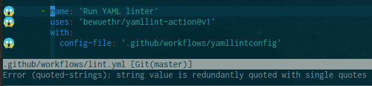
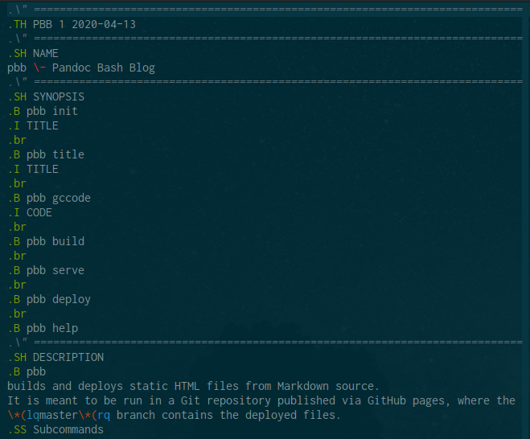
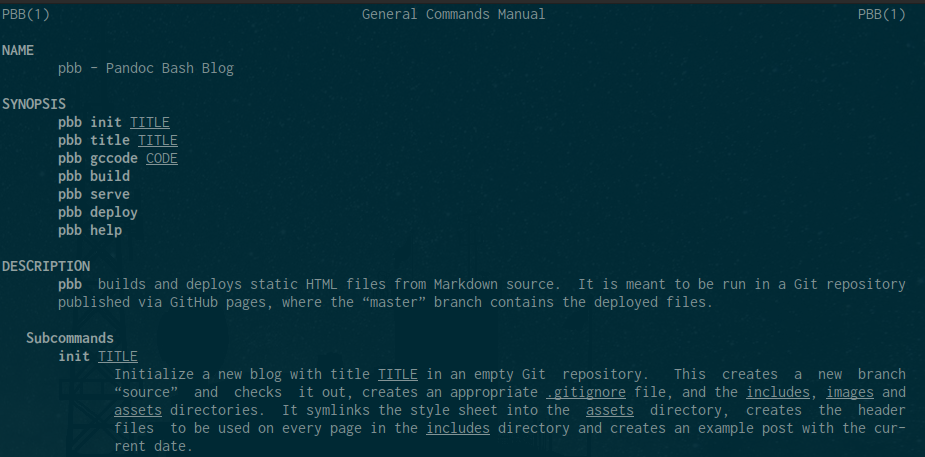

# Makefile, man page, TOC and CSS tweaks for Pandoc Bash Blog

I've added a few features to Pandoc Bash Blog since [adding GoatCounter]: some
cosmetic, some useful, some very behind the scenes.

  [adding GoatCounter]: 2020-04-04-goatcounter.html

## CSS tweaks

To separate code blocks more clearly from the rest of the text, they now have a
darker background colour:

And to tell inline code better apart, it got some colour as well:

I first used the same grey background as for code blocks just like for example
GitHub does for Markdown pages, but bumped into a snag; Pandoc believes that
whitespace should be conserved for inline code and sets `white-space: pre-wrap`
for `code`. This preserves whitespace, but still breaks lines; it does leave a
blank at the end of the line, though, and with a visible background colour,
that blank can be seen.

So, a different font colour it was, and after looking at the defaults for a few
CSS frameworks, I settled on `#C7254E`. Which keeps the blank, it's just
invisible now.

And finally, because I noticed that my amateur mess of font sizes resulted in
tiny code in headings, I switched everything to relative font sizes using
`rem`s and `em`s, and in an exhaustive test of one browser on two screens,
nothing looks fundamentally broken, so I declare that a success.

## YAML lint action

All those  actions I wrote [when a learned about GitHub Actions] have generated
quite a pile of YAML files: each action has one for metadata, and each workflow
is in one. Since all the actions run on each other, that results in about a
dozen or so YAML files floating around.

What's more obvious than having yet another action to lint these as well? [Run
yamllint] to the rescue!

The action wraps [yamllint] and works pretty much the same as the [Run
markdownlint] action: the linter checks the whole repo, and an optional config
file can be supplied. As for the Markdown linter, I fetch my own from my
[dotfiles].

Now I just have to update all my files because I recently enabled a new quoting
rule...

Anyway, I mention this here because Pandoc Bash Blog uses this action to lint
its YAML files.

  [when a learned about GitHub Actions]: 2020-03-16-github-actions-pbb.html
  [Run yamllint]: https://github.com/marketplace/actions/run-yamllint
  [yamllint]: https://github.com/adrienverge/yamllint
  [Run markdownlint]: https://github.com/marketplace/actions/run-markdownlint-mdl
  [dotfiles]: https://github.com/bewuethr/dotfiles/blob/master/.config/yamllint/config

## Makefile for installation

As a side effect of having grown from very minimal to slightly more involved,
pbb used to make a bunch of assumptions about where specific files would live.
At first, I just symlinked things like the style sheet from the pbb directory
into this blog; later, I updated `pbb init` to symlink from the `/usr/local`
hierarchy and the Bats test setup would actually copy things there.

Now, finally, there is a proper way to install pbb from scratch: a Makefile!
I'm far from a Make expert, but let's say I have seen worse than [this]. The
file is "self-documenting" by way of parsing specifically formatted comments
with Awk, offers a "dev mode" option to symlink instead of copy things, has an
uninstall recipe, and respects the [XDG Base Directory Specificiation]. Or at
least my personal flavour of it, combined with a sprinkle of the [systemd file
system hierarchy]. Everything goes into `~/.local/share` (or wherever
`$XDG_DATA_HOME` points to), and the binary lives in `~/.local/bin`, leaving
both `$HOME` clutter free and allowing for non-sudo installation.

Since I'm not compiling anything, the Makefile is basically a weird shell
script wrapper, but "use `make install`" just has such a nice ring to it.

I *did* realize that building the blog is actually a pretty good use case for a
Makefile---rebuild those pages where the Markdown version is more recent---but
that ship has sailed. Bash it is.

  [this]: https://github.com/bewuethr/pandoc-bash-blog/blob/e3618db2daf0267efd38f39e832ceccd00f183f5/Makefile
  [XDG Base Directory Specificiation]: https://specifications.freedesktop.org/basedir-spec/basedir-spec-latest.html
  [systemd file system hierarchy]: https://www.freedesktop.org/software/systemd/man/file-hierarchy.html

## A man page for pbb

Last, but not least, pbb now has a proper man page. It's officially the
official source of truth, other than the code itself, that is.

Not everybody considers writing documents using the `man` macros for `roff`
exactly "thrilling" or "fun" or "not a waste of time", but I kind of like it.
It's a bit like Markdown's great-great-great-grandma! I keep hearing about
`mdoc` being all the rage (mostly when I read anything written by its author)
and "semantic" instead of just "presentation formatting", but whenever I think
of it, I'm already halfway through whatever I'm writing and promise myself to
check it out next time.

I try and follow the Linux man page conventions as outlined by [`man-pages(7)`]
regarding structure and style; the man page for the `man` macros [`man(7)`] and
its longer cousin [`groff_man(7)`] come in handy to remind me of how to start a
paragraph with a hanging tag (`.TP`!) and how to get pretty quotes (`\*(lq` and
`\*(rq`!); the GNU `roff` short reference [`groff(7)`] is useful for all those
non-`man` requests (new line? `.br`); and finally, if all else fails, there's
always the full-blown [GNU `troff` manual].

There surely are a lot of `man` man pages.

In the end, all that counts is that going from this

to this

is super satisfying. To me.

  [`man-pages(7)`]: http://man7.org/linux/man-pages/man7/man-pages.7.html
  [`man(7)`]: http://man7.org/linux/man-pages/man7/man.7.html
  [`groff_man(7)`]: http://man7.org/linux/man-pages/man7/groff_man.7.html
  [`groff(7)`]: http://man7.org/linux/man-pages/man7/groff.7.html
  [GNU `troff` manual]: https://www.gnu.org/software/groff/manual/groff.html
