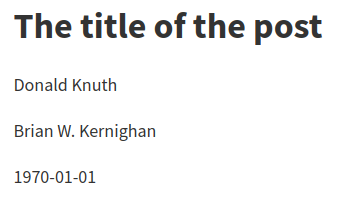

```markdown
One or more lines of text followed by one or more blank lines.
Newlines are treated as spaces.

Put two or more spaces at the end of a line for a hard line break.  
Like this.
```

One or more lines of text followed by one or more blank lines.
Newlines are treated as spaces.

Put two or more spaces at the end of a line for a hard line break.  
Like this.

---

`+escaped_line_breaks`

---

```markdown
This extension allows hard linebreaks\
with backslash followed by a newline.
```

This extension allows hard linebreaks\
with backslash followed by a newline.

---

## [Headings]

  [Headings]: https://pandoc.org/MANUAL.html#headings

### [Setext-style headings]

  [Setext-style headings]: https://pandoc.org/MANUAL.html#setext-style-headings

---

```markdown
A level-one heading
===================

A level-two heading
-------------------
```

<h1 class="title">A level-one heading</h1>

<h1>A level-two heading</h1>

---

### [ATX-style headings]

  [ATX-style headings]: https://pandoc.org/MANUAL.html#atx-style-headings

---

```markdown
## A level-two heading

### A level-three heading ###

# A level-one heading with a [link](/url) and *emphasis*
```

<h1>A level-two heading</h1>

### A level-three heading {.unlisted}

<h1 class="title">A level-one heading with a [link](/url) and *emphasis*</h1>

---

`+blank_before_header`

This extension requires a blank line before headings to allow for `#` at the
beginning of a line without creating a heading:

---

```markdown
In the Go GitHub repository, issue
#10000 is about switch statements.
```

In the Go GitHub repository, issue
#10000 is about switch statements.

---

`+space_in_atx_header`

A space is required between `#` and the heading text in ATX headers.

---

```markdown
#golang is the hashtag used for Go on Twitter.
```

#golang is the hashtag used for Go on Twitter.

---

### [Heading identifiers]

  [Heading identifiers]: https://pandoc.org/MANUAL.html#heading-identifiers

`+header_attributes`

Assign attributes to headers; I use this in this document to prevent headings
from showing up in the table of contents.

---

```markdown
## Heading that won't show up in TOC {.unlisted}
```

## Heading that won't show up in TOC {.unlisted}

---

`+implicit_header_references`

Reference links for headings are implicitly defined.

---

```markdown
### My section title

These all link to the heading of this section:
[My section title],
[My section title][],
[this section][my section title],
[this section](#my-section-title)
```

### My section title {.unlisted}

These all link to the heading of this section: [My section title], [My section
title][], [this section][my section title], [this section](#my-section-title)

---

## [Block quotations]

  [Block quotations]: https://pandoc.org/MANUAL.html#block-quotations

Block quotes have each line preceded by `>` and an optional space.

---

```markdown
> This is a block quote. This
> paragraph has two lines.
>
> 1. This is a list inside a block quote.
> 2. Second item.
```

> This is a block quote. This
> paragraph has two lines.
>
> 1. This is a list inside a block quote.
> 2. Second item.

---

A "lazy" form with just one `>` per block works as well, but paragraphs seem to
be considered separate blockquotes.

---

```markdown
> This is a block quote. This
paragraph has two lines.

> 1. This is a list inside a block quote.
2. Second item.
```

> This is a block quote. This
paragraph has two lines.

> 1. This is a list inside a block quote.
2. Second item.

---

Block quotes can be nested.

---

```markdown
> This is a block quote.
>
> > A block quote within a block quote.
```

> This is a block quote.
>
> > A block quote within a block quote.

---

The optional blank after `>` is part of the marker, so indented code blocks
need five spaces after the marker.

```markdown
>     import "fmt"
```

>     import "fmt"

---

`+blank_before_blockquote`

A blank line is required before a block quote.

---

```markdown
> This is a block quote.
> > This is not considered nested.
```

> This is a block quote.
> > This is not considered nested.

---

## [Verbatim (code) blocks]

  [Verbatim (code) blocks]: https://pandoc.org/MANUAL.html#verbatim-code-blocks

### [Indented code blocks]

  [Indented code blocks]: https://pandoc.org/MANUAL.html#indented-code-blocks

Indent by four spaces or one tab for a verbatim block.

---

```markdown
    func main() {
        fmt.Println("Hello, world")
    }
```

    func main() {
        fmt.Println("Hello, world")
    }

---

### [Fenced code blocks]

  [Fenced code blocks]: https://pandoc.org/MANUAL.html#fenced-code-blocks

`+fenced_code_blocks`

Wrap code block between lines of at least three `~`, where the end row must be
at least as long as the starting row. (Notice how this confuses the syntax
highlighter for Markdown!)

---

```markdown
~~~~~~
func main() {
    fmt.Println("Hello, world")
}
~~~~~~
```

~~~~~~
func main() {
    fmt.Println("Hello, world")
}
~~~~~~

---

If the code block contains `~`, use more `~` outside.

---

```markdown
~~~~~
~~~
code including ~
~~~
~~~~~
```

~~~~~
~~~
code including ~
~~~
~~~~~

---

`+backtick_code_blocks`

Just like fenced code blocks, but with `` ` `` instead of `~`.

---

````markdown
```
func main() {
    fmt.Println("Hello, world")
}
```
````

```
func main() {
    fmt.Println("Hello, world")
}
```

---

`+fenced_code_attributes`

Attach atttributes to fenced or backtick code blocks. The `numberLines` class
numbers lines and makes the line numbers anchors. (`number-lines` works as
well.)

---

```markdown
~~~~ {#mycode .go .numberLines startFrom="99"}
type Organs []*Organ

func (s Organs) Len() int      { return len(s) }
func (s Organs) Swap(i, j int) { s[i], s[j] = s[j], s[i] }
~~~~~~~~~~~~~~~~~~~~~~~~~~~~~~~~~~~~~~~~~~~~~~~~~~~~~~~~~~
```

~~~~ {#mycode .go .numberLines startFrom="99"}
type Organs []*Organ

func (s Organs) Len() int      { return len(s) }
func (s Organs) Swap(i, j int) { s[i], s[j] = s[j], s[i] }
~~~~~~~~~~~~~~~~~~~~~~~~~~~~~~~~~~~~~~~~~~~~~~~~~~~~~~~~~~

---

`lineAnchors` (or `line-anchors`) is supposed to make the lines themselves
clickable anchors, but all I get is an empty `<a>` tag, which isn't very
clickable. [This issue] seems to be related, but I didn't get it to work.

  [This issue]: https://github.com/jgm/pandoc/issues/4386

Language selection can be abbreviated:

---

~~~markdown
```go
var start time.Time
```
~~~

```go
var start time.Time
```

---

## [Line blocks]

  [Line blocks]: https://pandoc.org/MANUAL.html#line-blocks

`+line_blocks`

Blocks where lines begin with `|` will maintain division into lines and leading
whitespace. Formatting is still applied. When wrapping, continuation lines must
begin with a space.

---

```markdown
| Much simpler than, say, FTP,
| What made Gopher appealing to me
|    (And of fabulous worth
|    Ere the internet's birth)
| Was the hyperlinked knowledge, all free.

| Line continuations *must*
  start with blanks.
| Just like this.
```

| Much simpler than, say, FTP,
| What made Gopher appealing to me
|    (And of fabulous worth
|    Ere the internet's birth)
| Was the hyperlinked knowledge, all free.

| Line continuations *must*
  start with blanks.
| Just like this.

---

## [Lists]

  [Lists]: https://pandoc.org/MANUAL.html#lists

### [Bullet lists]

  [Bullet lists]: https://pandoc.org/MANUAL.html#bullet-lists

Different markers can be used. Compact list:

---

```markdown
- one
+ two
* three
```

- one
+ two
* three

---

"Loose" list with paragraph for each item:

---

```markdown
- one

- two

- three
```

- one

- two

- three

---

Item with multiple lines:

---

```markdown
- here is my
  first item.
- and my second.
```

- here is my
  first item.
- and my second.

---

"Lazy" format is also allowed:

---

```markdown
- here is my
first item.
- and my second.
```

- here is my
first item.
- and my second.

---

### [Block content in list items]

  [Block content in list items]: https://pandoc.org/MANUAL.html#block-content-in-list-items

List items can have multiple paragraphs and code blocks:

---

```markdown
- First paragraph.

  Continued.

- Second paragraph. With a code block, which must be indented four
  spaces more than the first non-space character after the list
  marker:

      { code }
```

- First paragraph.

  Continued.

- Second paragraph. With a code block, which must be indented four spaces more
  than the first non-space character after the list marker:

      { code }

---

Continuation after a code block has to be indented two more than the list
marker:

---

```markdown
-     code

  continuation paragraph
```

-     code

  continuation paragraph

---

Lists can be nested; nested lists don't have to be surrounded by blank lines.
The markers have to line up with the first non-space character after the marker
of the parent list.

---

```markdown
- C-style languages
  - C
  - C++
  - Go
- Soups
  - Vegetable soups
    - Tomato soup
    - Broccoli soup
  - Chicken soup
```

- C-style languages
  - C
  - C++
  - Go
- Soups
  - Vegetable soups
    - Tomato soup
    - Broccoli soup
  - Chicken soup

---

Continuation blocks in "lazy" lists must be indented:

---

```markdown
- A lazy list item
without indentation on the second line.

- Another lazy list
item without indentation.

  A continuation paragraph has to
be indented.
```

- A lazy list item
without indentation on the second line.

- Another lazy list
item without indentation.

  A continuation paragraph has to
be indented.

---

### [Ordered lists]

  [Ordered lists]: https://pandoc.org/MANUAL.html#ordered-lists

Standard ordered lists use decimal numbers followed by period and space; the
actual numbers are ignored (but see `+startnum` below):

---

```markdown
1. one
5. two
7. three
```

1. one
5. two
7. three

---

`+fancy_lists`

This extension allows using uppercase/lowercase letters and roman numerals as
well as enclosing or just closing parentheses.

`+startnum`

This extension preserves the starting number of an ordered list.

---

```markdown
1. arabic 1 with period
2. arabic 2 with period

a. lowercase with period
a. lowercase with period

i) roman i with closing parens
ii) roman ii with closing parens

(A) uppercase letter A enclosed in parens
(B) uppercase letter B enclosed in parens

A.  uppercase letter with period requires two spaces!
B.  uppercase letter with period requires two spaces!

(C) is formatted as a list; `+startnum` preserves "C" here

(C\) has to be escaped to prevent list formatting
```

1. arabic 1 with period
2. arabic 2 with period

a. lowercase with period
a. lowercase with period

i) roman i with closing parens
ii) roman ii with closing parens

(A) uppercase letter A enclosed in parens
(B) uppercase letter B enclosed in parens

A.  uppercase letter with period requires two spaces!
B.  uppercase letter with period requires two spaces!

(C) is formatted as a list; `+startnum` preserves "C" here

(C\) has to be escaped to prevent list formatting

---

Notice that HTML output still uses periods for all list markers. Other output
formats such as LaTeX preserve the marker styling.

Each new list marker type starts a new list:

---

```markdown
(2) Two
(5) Three
1. Four
- Five
```

(2) Two
(5) Three
1. Four
- Five

---

`+fancy_lists` allows to use `#` instead of a numeral:

---

```markdown
#. one
#. two

(5) five
(#) six

#) one
#) two
```

#. one
#. two

(5) five
(#) six

#) one
#) two

---

`+task_lists`

Borrowed from GitHub Flavoured Markdown:

---

```markdown
- [ ] to do
- [x] done
```

- [ ] to do
- [x] done

---

### [Definition lists]

  [Definition lists]: https://pandoc.org/MANUAL.html#definition-lists

`+definition_lists`

Borrowed from PHP Markdown Extra. Terms must fit on one line; definitions start
with an optionally indented colon or tilde. The definition body (including the
first line, minus the marker) is indented four spaces or one tab.

---

```markdown
Term 1

:   Definition 1

Term 2 with *inline markup*

:   Definition 2.1

        { code block, part of definition 2.1 }

    Another paragraph in definition 2.1

:   Definition 2.2; a term can have multiple definitions
```

Term 1

:   Definition 1

Term 2 with *inline markup*

:   Definition 2.1

        { code block, part of definition 2.1 }

    Another paragraph in definition 2.1

:   Definition 2.2; a term can have multiple definitions

---

Continuation in definitions can be lazy:

---

```markdown
Term 1

:   Definition
with lazy continuation.

    Continuation block elements still require indentation.
```

Term 1

:   Definition
with lazy continuation.

    Continuation block elements still require indentation.

---

For compact definition lists, the blank line before the definition can be
omitted:

---

```markdown
Term 1
  ~ Definition 1

Term 2
  ~ Definition 2a
  ~ Definition 2b with
lazy continuation
```

Term 1
  ~ Definition 1

Term 2
  ~ Definition 2a
  ~ Definition 2b with
lazy continuation

---

### [Numbered example lists]

  [Numbered example lists]: https://pandoc.org/MANUAL.html#numbered-example-lists

`+example_lists`

The `@` marker can be used for sequentially numbered examples across the whole
document.

---

```markdown
@. Example 1
@. Example 2

Text between examples.

@. Example 3
```

@. Example 1
@. Example 2

Text between examples.

@. Example 3

---

Numbered examples can be labeled and referred to:

---

```markdown
(@label) This is an example.

    Example list continuations are always indented by four spaces.

As example @label illustrates, ...
```

(@label) This is an example.

    Example list continuations are always indented by four spaces.

As example @label illustrates, ...

---

### [Compact and loose lists]

  [Compact and loose lists]: https://pandoc.org/MANUAL.html#compact-and-loose-lists

If list item text is followed by a blank line, it is treated as a paragraph,
otherwise the list becomes "compact".

In this case, "Second" is not followed by a blank line, so it's not a
paragraph:

---

```markdown
- First
- Second:
  - Foo
  - Bar
  - Baz

- Third
```

- First
- Second:
  - Foo
  - Bar
  - Baz

- Third

---

### [Ending a list]

  [Ending a list]: https://pandoc.org/MANUAL.html#ending-a-list

Inserting an indented code block right after a list results in a continuation
paragraph:

---

```markdown
- one
- two

    { code }
```

- one
- two

    { code }

---

Insert unindented content that won't produce visible output to end a list:

---

```markdown
- one
- two

<!-- -->

    { code }
```

- one
- two

<!-- -->

    { code }

---

This also allows separating consecutive lists:

---

```markdown
1. one
2. two
3. three

<!-- -->

1. one again
2. two again
3. three again
```

1. one
2. two
3. three

<!-- -->

1. one again
2. two again
3. three again

---

## [Horizontal rules]

  [Horizontal rules]: https://pandoc.org/MANUAL.html#horizontal-rules

Three or more of `*`, `-` or `_` (optionally space separated) produce a
horizontal rule.

---

```markdown
_ _ _ _ _

---

***************
```

_ _ _ _ _

---

***************

---

## [Tables]

  [Tables]: https://pandoc.org/MANUAL.html#tables

`+table_captions`

An optional paragraph beginning with `Table:` or just `:` before or after the
table is used as the table caption.

`+simple_tables`

Header and table rows must fit on a single line. Alignment is controlled with
the dashed line under the header line.

---

```markdown
 Right     Left   Center    Default
------     ----- --------   -------
    12     12      12           12
   123     123     123         123
     1     1        1            1

Table: Demonstration of simple table syntax.
```

 Right     Left   Center    Default
------     ----- --------   -------
    12     12      12           12
   123     123     123         123
     1     1        1            1

Table: Demonstration of simple table syntax.

---

The table is ended by a blank line or a line of dashes followed by a blank
line.

The header row can be omitted; alignment is controlled using the first line of
the table body in that case and the dashed final line is mandatory.

---

```markdown
----  ----  -----  ----
  12  12     12      12
 123  123    123    123
   1  1       1       1
----  ----  -----  ----
```

----  ----  -----  ----
  12  12     12      12
 123  123    123    123
   1  1       1       1
----  ----  -----  ----

---

`+multiline_tables`

Like simple tables, but require row of dashes above header text and after
table; rows must be separated by blank lines. Writers adapt column width to
relative input widths.

---

```markdown
----------------------------------------------------------
 Centered   Default           Right  Left
  Header    Aligned         Aligned  Aligned
----------  -------  --------------  ---------------------
 First      row                12.0  Example of a row that
                                     spans multiple lines.

 Second     row                 5.0  Another multiline row
                                     after a blank line.
----------------------------------------------------------

Table: This is the multiline
table caption.
```

----------------------------------------------------------
 Centered   Default           Right  Left
  Header    Aligned         Aligned  Aligned
----------  -------  --------------  ---------------------
 First      row                12.0  Example of a row that
                                     spans multiple lines.

 Second     row                 5.0  Another multiline row
                                     after a blank line.
----------------------------------------------------------

Table: This is the multiline
table caption.

---

The header can be omitted.

---

```markdown
----------- ------- --------------- -------------------------
   First    row                12.0 Example of a row that
                                    spans multiple lines.

  Second    row                 5.0 Here's another one. Note
                                    the blank line between
                                    rows.
----------- ------- --------------- -------------------------

: Here's a multiline table without a header.
```

----------- ------- --------------- -------------------------
   First    row                12.0 Example of a row that
                                    spans multiple lines.

  Second    row                 5.0 Here's another one. Note
                                    the blank line between
                                    rows.
----------- ------- --------------- -------------------------

: Here's a multiline table without a header.

---

`+grid_tables`

The header is separated by a row of `=` and can be omitted. Cells may contain
arbitrary block elements.

---

```markdown
: Sample grid table.

+---------------+---------------+--------------------+
| Fruit         | Price         | Advantages         |
+===============+===============+====================+
| Bananas       | $1.34         | - built-in wrapper |
|               |               | - bright color     |
+---------------+---------------+--------------------+
| Oranges       | $2.10         | - cures scurvy     |
|               |               | - tasty            |
+---------------+---------------+--------------------+
```

: Sample grid table.

+---------------+---------------+--------------------+
| Fruit         | Price         | Advantages         |
+===============+===============+====================+
| Bananas       | $1.34         | - built-in wrapper |
|               |               | - bright color     |
+---------------+---------------+--------------------+
| Oranges       | $2.10         | - cures scurvy     |
|               |               | - tasty            |
+---------------+---------------+--------------------+

---

Alignment is controlled with colons in the header separator line.

---

```markdown
+---------------+---------------+----------------------+
| Right         | Left          | Centered             |
+==============:+:==============+:====================:+
| Bananas       | $1.34         | ```go                |
|               |               | fmt.Println("hello") |
|               |               | ```                  |
+---------------+---------------+----------------------+
```

+---------------+---------------+----------------------+
| Right         | Left          | Centered             |
+==============:+:==============+:====================:+
| Bananas       | $1.34         | ```go                |
|               |               | fmt.Println("hello") |
|               |               | ```                  |
+---------------+---------------+----------------------+

---

Headerless tables have the alignment control on the top line.

---

```markdown
+------:+:-----+:--------:+
| Right | Left | Centered |
+-------+------+----------+
| x     | x    | x        |
+-------+------+----------+
```

+------:+:-----+:--------:+
| Right | Left | Centered |
+-------+------+----------+
| x     | x    | x        |
+-------+------+----------+

---

`+pipe_tables`

These seem to be the same as the tables in GitHub Flavored Markdown.

---

```markdown
| Right | Left | Default | Center |
|------:|:-----|---------|:------:|
|   12  |  12  |    12   |    12  |
|  123  |  123 |   123   |   123  |
|    1  |    1 |     1   |     1  |

  : Demonstration of pipe table syntax.
```

| Right | Left | Default | Center |
|------:|:-----|---------|:------:|
|   12  |  12  |    12   |    12  |
|  123  |  123 |   123   |   123  |
|    1  |    1 |     1   |     1  |

  : Demonstration of pipe table syntax.

---

The header can't be omitted; the beginning and ending pipe characters are
optional.

---

```markdown
fruit|price
-----|-----:
apple|2.05
pear|1.37
orange|3.09
```

fruit|price
-----|-----:
apple|2.05
pear|1.37
orange|3.09

---

If the table is wider than the column width, cell contents wrap with the
relative column width determined by the number of dashes in the line separating
the header from the table body.

---

```markdown
wide column|narrow column
---|-
short text|longer text which wraps because there's only one dash on this side
```

wide column|narrow column
---|-
short text|longer text which wraps because there's only one dash on this side

---

Instead of `|` to separate fields in the delimiter row, `+` also works.

---

```markdown
| One | Two   |
|-----+-------|
| my  | table |
| is  | nice  |
```

| One | Two   |
|-----+-------|
| my  | table |
| is  | nice  |

---

## [Metadata blocks]

  [Metadata blocks]: https://pandoc.org/MANUAL.html#metadata-blocks

`+pandoc_title_block`

Specify title, author and date in a title block at the beginning of the file:

---

```markdown
% The title of the post
% Donald Knuth; Brian W. Kernighan
% 1970-01-01
```



This also sets meta tags for the authors and the date:

```html
<meta name="author" content="Donald Knuth" />
<meta name="author" content="Brian W. Kernighan" />
<meta name="dcterms.date" content="1970-01-01" />
```

Author and date get separate classes and can be styled with CSS.

---

Date or date and authors can just be skipped; to skip the title, or skip the
authors but use a date, blank lines have to be used.

`+yaml_metadata_block`

Arbitrary metadata can be set in a YAML block; I use this to [control table of
contents] generation. The template has to match the structure; the default HTML
template includes for example a `keywords` array.

---

```markdown
---
keywords:
  - unix
  - linux
...
```

which results in metadata like

```html
<meta name="keywords" content="unix, linux" />
```

---

With a little template fiddling, this can become a tagging system.

  [control table of contents]: 2020-04-17-pbb-makefile-manpage.html#optional-table-of-contents

## [Backslash escapes]

  [Backslash escapes]: https://pandoc.org/MANUAL.html#backslash-escapes

`+all_symbols_escapable`

Any symbol can be escaped to prevent it from having a formatting effect. An
escaped space (supposedly) becomes a literal Unicode nonbreaking space. Like
with `+escaped_line_breaks`, an escaped newline is a hard linebreak.

---

```markdown
*\*hello\**

**hello**\
escaped\ space
```

*\*hello\**

<!-- fix vim pandoc syntax highlighter: *** -->

**hello**\
escaped\ space

---

## [Inline formatting]

  [Inline formatting]: https://pandoc.org/MANUAL.html#inline-formatting

### [Emphasis]

  [Emphasis]: https://pandoc.org/MANUAL.html#emphasis

Emphasis is toggled with `*` or `_`; when escaped or surrounded by spaces, they
won't trigger emphasis.

---

```markdown
Use *asterisks* or _underscores_ for emphasis.

**Double them** for __strong emphasis__.

\*Escaped\* or _ standalone _ characters are literal.
```

Use *asterisks* or _underscores_ for emphasis.

**Double them** for __strong emphasis__.

\*Escaped\* or _ standalone _ characters are literal.

---

`+intraword_underscores`

`_` within a word is not an emphasis marker; use `*` to emphasize parts of a
word.

---

```markdown
*Emph*asized, but un_im_pres_sed.
```

*Emph*asized, but un_im_pres_sed.

<!-- fix vim pandoc syntax highlighter: * -->

---

### [Strikeout]

  [Strikeout]: https://pandoc.org/MANUAL.html#strikeout

`+strikeout`

Strike out words by delimiting with `~~`; this renders as a `<del>` element.

---

```markdown
Coffee is ~~a drug~~ the best thing ever!
```

Coffee is ~~a drug~~ the best thing ever!

---

### [Superscripts and subscripts]

  [Superscripts and subscripts]: https://pandoc.org/MANUAL.html#superscripts-and-subscripts

`+superscript`, `+subscript`

Use `^` and `~` for superscript and subscript. Spaces in the super-/subscripted
text have to be escaped.

---

```markdown
Super^script^ and sub~script~

P~is\ correct~ but P~is wrong~
```

Super^script^ and sub~script~

P~is\ correct~ but P~is wrong~

---

### [Verbatim]

  [Verbatim]: https://pandoc.org/MANUAL.html#verbatim

Verbatim text goes inside backticks; use double backticks to include a
backtick.

---

```markdown
Check out the `README.md`.

Prefer `$(cmd)` over `` `cmd` ``.
```

Check out the `README.md`.

Prefer `$(cmd)` over `` `cmd` ``.

---

`+inline_code_attributes`

Inline code takes the same attributes as fenced code blocks.

---

```markdown
Use `for f in ./*`{.bash} instead of `for f in $(ls)`{.bash}.
```

Use `for f in ./*`{.bash} instead of `for f in $(ls)`{.bash}.

---

### [Small caps]

  [Small caps]: https://pandoc.org/MANUAL.html#small-caps

There is a `smallcaps` class; this example uses the `bracketed_spans` extension
(see [Divs and Spans](#divs-and-spansdands)), an HTML `class` attribute and
inline CSS.

---

```markdown
[With an extension]{.smallcaps}

<span class="smallcaps">With an HTML class attribute</span>

<span style="font-variant:small-caps">With inline CSS</span>
```

[With an extension]{.smallcaps}

<span class="smallcaps">With an HTML class attribute</span>

<span style="font-variant:small-caps">With inline CSS</span>

---

## [Math]

  [Math]: https://pandoc.org/MANUAL.html#math

`+tex_math_dollars`

Text between pairs of `$` or `$$` is rendered as TeX Math. For HTML without
further options, Unicode characters are used; use MathJax for better results
(as done for this post).

---

```markdown
Einstein came up with $E = m\text{c}^2$.

This is Euler's formula: $$e^{i \cdot pi} = -1$$

Escape literal dollar signs to prevent math rendering: \$bling\$

$10,000 and $20,000 don't have to be escaped.
```

Einstein came up with $E = m\text{c}^2$.

This is Euler's formula: $$e^{i \cdot \pi} = -1$$

Escape literal dollar signs to prevent math rendering: \$bling\$

$10,000 and $20,000 don't have to be escaped.

<!-- fix vim pandoc syntax highlighter: $ -->

---

## [Raw HTML]

  [Raw HTML]: https://pandoc.org/MANUAL.html#raw-html

`+raw_html`

Raw HTML can be included directly.

`+markdown_in_html_blocks`

Unlike original Markdown, this extension will still interpret Markdown in raw
HTML blocks (except within `<script>` and `<style>` elements).

---

~~~markdown
<details>
<summary>What is your **Bash version**?</summary>
```bash
$  echo $BASH_VERSION
5.0.3(1)-release
```
</details>
~~~

<details>
<summary>What is your **Bash version**?</summary>
```bash
$  echo $BASH_VERSION
5.0.3(1)-release
```
</details>

---

`+native_divs`, `+native_spans`

These took me a while to understand, but after reading through [this long
issue], I believe all they do is convert `<div>` and `<span>` elements (enabled
via `markdown_in_html_blocks`) into `Div` and `Span` blocks in the pandoc AST,
but when writing to HTML, the result is the same. They are meant mostly for
usage with pandoc filters.

  [this long issue]: https://github.com/jgm/pandoc/issues/168

`+raw_tex`

This allows to write inline LaTeX, but it is ignored for HTML output.

### [Generic raw attribute]

  [Generic raw attribute]: https://pandoc.org/MANUAL.html#generic-raw-attribute

`+raw_attribute`

This allows inserting raw blocks of any target format and is of limited use
when targeting HTML as we can *already* insert HTML in Markdown.

---

~~~markdown
```{=html}
<p>This is HTML in a <i>raw</i> block.</p>
```

This is `<b>HTML</b>`{=html} in an inline raw block.
~~~

```{=html}
<p>This is HTML in a <i>raw</i> block.</p>
```

This is `<b>HTML</b>`{=html} in an inline raw block.

---

## [LaTeX macros]

  [LaTeX macros]: https://pandoc.org/MANUAL.html#latex-macros

`+latex_macros`

This lets you define LaTeX macros, and they are applied to LaTeX math and raw
LaTeX.

---

```markdown
\newcommand{\tuple}[1]{\langle #1 \rangle}

$\tuple{a, b, c}$
```

\newcommand{\tuple}[1]{\langle #1 \rangle}

$\tuple{a, b, c}$

---

## [Links]

  [Links]: https://pandoc.org/MANUAL.html#links-1

### [Automatic links]

  [Automatic links]: https://pandoc.org/MANUAL.html#automatic-links

URLs and email addresses enclosed in `<>` become links. (Tangent: there is an
option to obfuscate the produced email address, [`--email-obfuscation`], which
might come in handy.)

  [`--email-obfuscation`]: https://pandoc.org/MANUAL.html#option--email-obfuscation

---

```markdown
<https://www.benjaminwuethrich.dev>

<benjamin@benjaminwuethrich.dev>
```

<https://www.benjaminwuethrich.dev>

<benjamin@benjaminwuethrich.dev>

---

### [Inline links]

  [Inline links]: https://pandoc.org/MANUAL.html#inline-links

The first of the two "classic" styles.

---

```markdown
Link: [example](https://example.com)

Link with title: [example](https://example.com "Example website")

Email addresses need the `mailto` explicitly: [email
joe](mailto:joe@example.com)
```

Link: [example](https://example.com)

Link with title: [example](https://example.com "Example website")

Email addresses need the `mailto` explicitly: [email
joe](mailto:joe@example.com)

---

### [Reference links]

  [Reference links]: https://pandoc.org/MANUAL.html#reference-links

Link definitions have an optional title (which can be on a separate line). The
URL can be enclosed in `<>`; labels are case insensitive. Explicit reference
links have a separate label; in implicit links, the second pair of brackets is
empty.

Link definitions can appear in nested elements.

---

```markdown
Many links: [link 1][label 1], [link 2][label 2], [link 3][label 3],
[link 4][label 4], [link 5][label 5], [link 6][label 6],
[link 7][LABEL 7], [implicit link][].

[label 1]: /index.html  "Optional title"
[label 2]: /index.html
[label 3]: https://github.com/ (Title in parentheses)
[label 4]: #paragraphs  'Title in single quotes'
[label 5]: <https://example.com> "URL with angle brackets"
[label 6]: https://example.com
  "Title on another line"
[label 7]: /index.html
[implicit link]: /index.html

> A block [quote][].
>
> [quote]: /index.html
```

Many links: [link 1][label 1], [link 2][label 2], [link 3][label 3],
[link 4][label 4], [link 5][label 5], [link 6][label 6],
[link 7][LABEL 7], [implicit link][].

[label 1]: /index.html  "Optional title"
[label 2]: /index.html
[label 3]: https://github.com/ (Title in parentheses)
[label 4]: #paragraphs  'Title in single quotes'
[label 5]: <https://example.com> "URL with angle brackets"
[label 6]: https://example.com
  "Title on another line"
[label 7]: /index.html
[implicit link]: /index.html

> A block [quote][].
>
> [quote]: /index.html

---

`+shortcut_reference_links`

This allows to drop the empty second pair of brackets in implicit reference
links.

---

```markdown
A link to [my TAOP summary].

[my TAOP summary]: /2020-04-05-taop-summary.html
```

A link to [my TAOP summary].

[my TAOP summary]: /2020-04-05-taop-summary.html

---

### [Internal links]

  [Internal links]: https://pandoc.org/MANUAL.html#internal-links

---

```markdown
Use [heading identifiers](#heading-identifiers). See the [Headings
section].

[Headings section]: #headings
```

Use [heading identifiers](#heading-identifiers). See the [Headings
section].

[Headings section]: #headings

---

## [Images]

  [Images]: https://pandoc.org/MANUAL.html#images

A link preceded by `!` is treated as an image. The link text is used as the
image's alt text, and the link title becomes the image title.

`+implicit_figures`

An image with alt text alone in a paragraph is rendered as a figure with
caption; in HTML, this is done using a `<figure>` element containing a
`<figcaption>` element.

To avoid that, add a nonbreaking space after the image.

---

```markdown


\
```


\

---

`+link_attributes`

This allows to set attributes on links and images, which can be used for
styling. `width` and `height` can be used to control image size; values are
converted to pixels using 96dpi. The `--dpi` option and dpi image metadata
don't seem to have an effect for HTML output.

---

```markdown
![With `width=10%`][image1]

[image1]: images/2020-05-04-bashman.png {width=10%}

![With `height=30px`][image2]

[image2]: images/2020-05-04-bashman.png {height=30px}

![With `height=30px width=100px`][image3]

[image3]: images/2020-05-04-bashman.png {height=30px width=100px}

![With `width=1in`; becomes 96px][image4]

[image4]: images/2020-05-04-bashman.png {width=1in}
```

![With `width=10%`][image1]

[image1]: images/2020-05-04-bashman.png {width=10%}

![With `height=30px`][image2]

[image2]: images/2020-05-04-bashman.png {height=30px}

![With `height=30px width=100px`][image3]

[image3]: images/2020-05-04-bashman.png {height=30px width=100px}

![With `width=1in`; becomes 96px][image4]

[image4]: images/2020-05-04-bashman.png {width=1in}

---

## [Divs and Spans][dands]

  [dands]: https://pandoc.org/MANUAL.html#divs-and-spans

`+fenced_divs`

This allows to create native `Div` blocks; in HTML output, they become `<div>`
blocks. Attribute syntax is the same as for [fenced code blocks][fcb]. Fenced
divs can be nested.

  [fcb]: #fenced-code-blocks

---

```markdown
<style>
.warning, .error {
    padding: 10px;
}
.warning {
    color: #9F6000;
    background-color: #FEEFB3;
}
.error {
    color: #D8000C;
    background-color: #FFD2D2;
}
</style>

::::: warning
This is a warning.

::: error
Nested error!
:::
:::::
```

<style>
.warning, .error {
    padding: 10px;
}
.warning {
    color: #9F6000;
    background-color: #FEEFB3;
}
.error {
    color: #D8000C;
    background-color: #FFD2D2;
}
</style>

::::: warning
This is a warning.

::: error
Nested error!
:::
:::::

---

`+bracketed_spans`

A bracketed sequence directly followed by attributes becomes a `Span`.

---

```markdown
Here is an [inline warning!]{.warning}
```

Here is an [inline warning!]{.warning}

---

## [Footnotes]

  [Footnotes]: https://pandoc.org/MANUAL.html#footnotes

`+footnotes`

This allows footnotes. If the footnote contains multiple paragraphs, they must
be indented.

---

```markdown
Here is some text,[^1] and then some.[^label]

[^1]: And a footnote!

[^label]: This one has multiple paragaphs.

    Continuation is indented.

        { code }
```

Here is some text,[^1] and then some.[^label]

[^1]: And a footnote!

[^label]: This one has multiple paragaphs.

    Continuation is indented.

        { code }

---

`+inline_notes`

Footnotes can be inlined, but then you can't use multiple paragraphs.

---

```markdown
This is the text.^[And this is the inline footnote.]
```

This is the text.^[And this is the inline footnote.]

---

## [Citations]

  [Citations]: https://pandoc.org/MANUAL.html#citations

`+citations`

Together with the `pandoc-citeproc` filter, this allows generating citations
and a bibliography. For this document, I've used

```bash
pandoc-citeproc --bib2yaml
```

to generate a CSL YAML bibliography with three entries and stuck it into the
`references` field in the YAML front matter. I haven't changed the Citation
Style Language, so it defaults to Chicago Manual of Style author-date format.

I have set `link-citations: true`, which turn referenes into links to the
bibliography.

Citations go into square brackets:

---

```markdown
Blah blah [see @Ritchie1974, pp. 367-370; also @Wheeler1952, p. 235].

Blah blah [@Ritchie1974, pp. 367-368, 370-372 and *passim*].

Blah blah [@Ritchie1974; @Wheeler1952].
```

Blah blah [see @Ritchie1974, pp. 367-370; also @Wheeler1952, p. 235].

Blah blah [@Ritchie1974, pp. 367-368, 370-372 and *passim*].

Blah blah [@Ritchie1974; @Wheeler1952].

---

The *locator terms* such as `pp.`, `chapter` etc. are all recognized by
`pandoc-citeproc` and handled according to the selected style.

The locator can be explicitly separated from the suffix in complex cases:

---

```markdown
[@Ritchie1974{ii, A, D-Z}, with a suffix]

[@Wheeler1952, {pp. iv, vi-xi, (xv)-(xvii)} with suffix here]
```

[@Ritchie1974{ii, A, D-Z}, with a suffix]

[@Wheeler1952, {pp. iv, vi-xi, (xv)-(xvii)} with suffix here]

---

The author can be suppressed in the citation with `-@`, and there are in-text
citations:

---

```markdown
Ritchie says blah [-@Ritchie1974].

@Wheeler1952 says blah.

@Wheeler1952 [p. 235] says blah.
```

Ritchie says blah [-@Ritchie1974].

@Wheeler1952 says blah.

@Wheeler1952 [p. 235] says blah.

---

To list the works cited, a div with ID `refs` can be used:

---

```markdown
::: {#refs}
:::
```

---

If there isn't one (like in this document), the bibliography goes at the end. I
have set a section title for it in the metadata file using
`reference-section-title`.

An item that wasn't actually cited can be added to the bibliography by
including a `nocite` metadata field:

---

```yaml
---
nocite: |
  @Licklider1968
...
```

---
nocite: |
  @Licklider1968
...

---

A wildcard `@*` can be used to get all citations in the bibliography.
