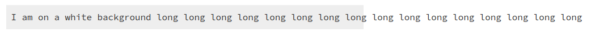
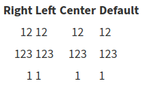
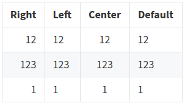

---
toc: true
...

# MathJax, bibliography and CSS tweaks for Pandoc Bash Blog

While writing [Everything Pandoc Markdown can do], in which I try to cover
everything possible when using Pandoc Markdown to generate HTML, I bumped into
a few things I had to fix while I went along: some CSS tweaks, and pbb wrappers
for MathJax and bibliography functionality. Looks like "CSS tweaks" is a common
theme in these update posts!

  [Everything Pandoc Markdown can do]: 2020-05-04-everything-pandoc-markdown.html

## CSS tweaks

### Code blocks

For this round of CSS tweaks, I removed the grey background from all `<pre>`
(code) blocks as I ran into problems when displaying code blocks with line
numbers; `overflow-x` would either make long lines overflow:



or make the line numbers disappear:


I'm pretty sure there would have been a solution to this, but it eluded me, so
now

- Code blocks with no indicated language such as

    ~~~markdown
    ```
    I am on a white background
    ```
    ~~~

  are just rendered like this:

  \

  (Using an image here so this still makes sense if the styling ever changes in
  the future.)

- Code blocks with a language indicated such as

    ~~~markdown
    ```bash
    echo "Hello there."
    ```
    ~~~

  are rendered on grey:

  \

- Code blocks with numbered lines such as

    ~~~markdown
    ```{.bash .numberLines}
    echo "Hello there."
    ```
    ~~~

  have non-invisible line numbers:

  \

### Tables

Default Pandoc HTML styling doesn't do anything with tables, and this



just doesn't look all that great.

I took some inspiration from how GitHub styles its tables, and now they look
like this:



## MathJax

Pandoc supports inline and display math (see [here]). To make it look prettier,
there is a range of [options]; I've settled on [MathJax]. This requires running
`pandoc` with the `--mathjax` option. I've introduced two new subcommands, `pbb
enable` and `pbb disable`, that allow toggling features like this one; after
setting `pbb enable math` and including inline or display math in a post, it'll
be rendered using MathJax.

$$\frac{p_4}{p_1} = \frac{p_2}{p_1} \left(1 - \frac{(\gamma_4 - 1)(a_1/a_4)(p_2/p_1 - 1)}{\sqrt{2\gamma_1 \bigl(2\gamma_1 + (\gamma_1 + 1)(p_2/p_1 - 1)\bigr)}}\right) ^{-2\gamma_4/(\gamma_4 - 1)}$$

(Taken from a [previous life]. Super useful if you have a [shock tube] lying
around somewhere.)

This means that either all or no pages are created using `--mathjax`. However,
if a page does not include any math, the MathJax script isn't loaded anyway, so
there's no unnecessary weight added.

  [here]: 2020-05-04-everything-pandoc-markdown.html#math
  [options]: https://pandoc.org/MANUAL.html#math-rendering-in-html
  [MathJax]: https://www.mathjax.org/
  [previous life]: https://www.research-collection.ethz.ch/handle/20.500.11850/150401
  [shock tube]: https://en.wikipedia.org/wiki/Shock_tube

## Bibliography and citations

The second feature that can be toggled using `pbb enable` is to allow using
citations and bibliography; `pbb enable bibliography` adds
`--filter=pandoc-citeproc` to the `pandoc` incantation.

After this, citations to a bibliography provided as a separate file or inline
in the YAML front matter are rendered using the default citation style, [Chicago
Manual of Style] author--date.

Pandoc supports any style supported by the [Citation Style Language] (CSL). Pbb
doesn't offer a convenient way to control this, but it can be changed by adding
a value for `csl` to the default metadata file, `.metadata.yml`. I'll revisit
when I think I sorely need more options for citations styles.

The current style can be seen in the [citations] section of my Pandoc Markdown
post. The heading of the bibliography is just "Bibliography", which can also be
changed in `.metadata.yml`.

  [Chicago Manual of Style]: https://www.chicagomanualofstyle.org/home.html
  [Citation Style Language]: https://citationstyles.org/
  [citations]: 2020-05-04-everything-pandoc-markdown.html#citations
