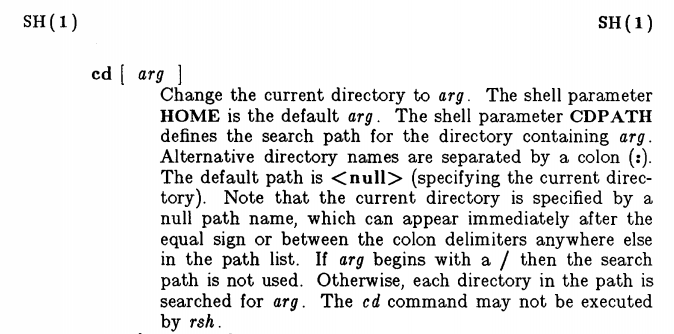

# Fixing `CDPATH`

Let's say we have a directory somewhere that we access often; maybe the
directory that contains all our projects, or the parent directory of a bunch of
services. And that directory has an annoyingly long path, potentially buried
deep in some `GOPATH`, for example. To get there, we have to type something
like

```bash
cd ~/go/src/github.com/bewuethr/awesome-project
```

every time. Unacceptable, right?

## Solution 1: alias

We can use an [alias]! That's what I did for a long time. I added

```bash
alias cdap='cd "$HOME/go/src/github.com/bewuethr/awesome-project"'
```

to my `~/.bashrc`[^1], and was able to navigate like

```bash
$ cdap
$ pwd
/home/benjamin/go/src/github.com/bewuethr/awesome-project
$ ls
bar  baz  foo  go.mod  go.sum
$ cd bar
$ pwd
/home/benjamin/go/src/github.com/bewuethr/awesome-project/bar
```

Great!

  [alias]: https://www.gnu.org/software/bash/manual/bash.html#Aliases

[^1]: Really to a separate file sourced from my `~/.bashrc`, but I'm getting
ahead of myself. The post about my (perfect) dotfile setup is still in the
making.

## (Failed) attempt at improvement: naïve `CDPATH`

I almost always want to access a subdirectory of `awesome-project`, rarely the
directory itself. Bash (or any POSIX conformant shell) has a shell variable
called [`CDPATH`][]: a colon-separated list of directories for `cd` to use as a
search path.

  [`CDPATH`]: https://www.gnu.org/software/bash/manual/bash.html#index-CDPATH

So, instead of my alias, I'd stick this into my `.bashrc`:

```bash
export CDPATH='/home/benjamin/go/src/github.com/bewuethr/awesome-project'
```

Now, from anywhere in my file system, I can just do this:

```bash
$ pwd
/path/to/some/random/directory
$ cd foo
/home/benjamin/go/src/github.com/bewuethr/awesome-project/foo
```

And sure enough, Bash even helpfully tells me that it took me there! Excellent.

Or is it? Let's assume I want to change into a directory `foo` within that
random directory:

```bash
$ pwd
/path/to/some/random/directory
$ ls
errcheck  foo  lint  vet
$ cd foo
/home/benjamin/go/src/github.com/bewuethr/awesome-project/foo
```

That took me to the `foo` from `CDPATH`! Definitely not what I wanted. I could
do this instead:

```bash
$ cd ./foo
$ pwd
/path/to/some/random/directory/foo
```

But in reality, that'd more likely look like

```bash
$ cd foo  # Oops, uses CDPATH!
/home/benjamin/go/src/github.com/bewuethr/awesome-project/foo
$ cd -  # Go to previous directory...
/path/to/some/random/directory
$ cd ./foo  # Be explicit with ./
```

and gone is any advantage `CDPATH` would have had over an alias. It tried using
it like this for a while, but it got too annoying and I gave up, went back to
my alias.

## Solution 2: `CDPATH` done right

Until one day, I really wanted to figure out if there isn't a better way. I
took a closer look at the Bash manual; from the description of the [`cd`]
builtin:

> If the shell variable `CDPATH` exists, it is used as a search path: each
> directory name in `CDPATH` is searched for *directory*, with alternative
> directory names in `CDPATH` separated by a colon (`:`).

And a bit later:

> If a non-empty directory name from `CDPATH` is used, or if `-` is the first
> argument, and the directory change is successful, the absolute pathname of
> the new working directory is written to the standard output.

That was the first hint: "non-empty directory name"!

In the [POSIX spec for `cd`][POSIX], we can read this:

> Starting with the first pathname in the \<colon>-separated pathnames of
> *CDPATH* [...] if the pathname is null, test if the concatenation of dot, a
> <slash> character, and the operand names a directory.

Even more explicit. A null pathname in `CDPATH` is replaced with `./`, which is
exactly what I want. The fix is really a one character change:

```bash
export CDPATH=':/home/benjamin/go/src/github.com/bewuethr/awesome-project'
#              └── this one!
```

This prepends a null directory to `CDPATH`.

Now I can do this:

```bash
$ pwd
/path/to/some/random/directory
$ ls
errcheck  foo  lint  vet
$ cd foo  # Does cd ./foo
$ pwd
/path/to/some/random/directory/foo
$ ls
foo.go
$ cd foo  # Uses non-null CDPATH path
/home/benjamin/go/src/github.com/bewuethr/awesome-project/foo
```

Much better!

  [`cd`]: https://www.gnu.org/software/bash/manual/bash.html#index-cd
  [POSIX]: https://pubs.opengroup.org/onlinepubs/9699919799/utilities/cd.html

## Not exactly new

As the POSIX spec tells us, `CDPATH` has been around since the System V shell.
And indeed, the manual for System V Release 3.5 has this to say:



## Bonus: tab completion

A nice side effect when using the (pretty standard) bash-completion package is
that it is fully `CDPATH` aware (see the [implementation of `_cd`][cd]), so I
can do

```bash
$ pwd
/home/benjamin/.vim
$ ls
after  autoload  bundle  colors  ftdetect
$ cd f<tab>
foo/      ftdetect/
```

and get both local and `CDPATH` directories.

  [cd]: https://github.com/scop/bash-completion/blob/ba4c941faa1ff5eb63e7984a6a52a7b703e2887f/bash_completion#L1794-L1840
