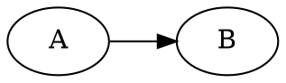
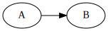

# Dot graphs for Pandoc Bash Blog

When I started working on [pbb], one of the features I wanted to add and was
most excited about was a way to extend Markdown to add code that describes
graphs or diagrams and replace it with the actual graph in the rendered output.
The corresponding issue is just eight days younger than the whole project.

  [pbb]: https://github.com/bewuethr/pandoc-bash-blog

## Text-based graphing tools

There are quite a few tools that let you make drawings from text input; I know
of

- [Graphviz], which includes the [dot] tool
- [PlantUML]
- [blockdiag]

Markdown extensions or Markdown-style markup languages that support diagrams
aren't a new invention either: for example, GitLab Markdown [supports Mermaid
and PlantUML][glmd], and Markdeep has [lots of diagrams][markdeep].

However, the point was in doing it myself, and since I'm most familiar with
dot, that's what I used.

  [Graphviz]: https://graphviz.org/
  [dot]: https://graphviz.org/doc/info/lang.html
  [PlantUML]: https://plantuml.com/
  [blockdiag]: http://blockdiag.com/en/
  [glmd]: https://docs.gitlab.com/ee/user/markdown.html#diagrams-and-flowcharts
  [markdeep]: https://casual-effects.com/markdeep/features.md.html#diagramexamples

## Pandoc Lua filters

Pandoc lets you manipulate its output by way of piping the intermediate
representation of a document (its abstract syntax tree, AST) through a filter.
That filter can either manipulate a JSON representation of the AST, or it can
use Lua to to manipulate it.

[JSON filters][json] are apparently best written in Haskell, but there are
libraries in other languages as well. I went with [Lua filters][lua] instead: I
always wanted to learn a bit of Lua, and the interpreter is built right into
pandoc. They're also faster, according to the docs.

The documentation is excellent, and after a Lua [crash course][luacourse], I
was ready write my filter. There is a GitHub repository with a [collection of
pandoc Lua filters][github], which even includes a [diagram
generator][dg]---pretty much a superset of what I wanted to build. I definitely
had a few closer looks at it whenever I got stuck.

The main difference is probably that the example diagram generator uses the
"[media bag]" for images, whereas I write them directly to the filesystem.
Using the media bag requires the [`--extract-media`][em] option, and that
[messes with the relative paths][emissue] of all images, which I wanted to
avoid.

  [json]: https://pandoc.org/filters.html
  [lua]: https://pandoc.org/lua-filters.html
  [luacourse]: https://learnxinyminutes.com/docs/lua/
  [github]: https://github.com/pandoc/lua-filters
  [dg]: https://github.com/pandoc/lua-filters/tree/master/diagram-generator
  [media bag]: https://pandoc.org/lua-filters.html#module-pandoc.mediabag
  [em]: https://pandoc.org/MANUAL.html#option--extract-media
  [emissue]: https://github.com/jgm/pandoc/issues/1986

## Usage

The [final product][dotgraph.lua] is a filter that checks for each code block
if it has class `dot`, and if so, the code is piped to dot and the block then
replaced with the generated graph. Like this:

~~~~markdown

~~~~

produces


To get a caption (and an HTML `<figure>`), the property can be added:

~~~~markdown
``` {.dot caption="A caption!"}
digraph G {
    rankdir = "LR"
    A -> B
}
```
~~~~

resulting in

``` {.dot caption="A caption!"}
digraph G {
    rankdir = "LR"
    A -> B
}
```

And finally, to get the dot description as HTML comments next to the figure
(for, I don't know, the people who want to recreate that great graph
themselves), a special class `includeSource` can be added:

~~~~markdown
``` {.dot .includeSource caption="A caption!"}
digraph G {
    rankdir = "LR"
    A -> B
}
```
~~~~

for which the graph looks the same:

``` {.dot .includeSource caption="A caption!"}
digraph G {
    rankdir = "LR"
    A -> B
}
```

but the HTML source now includes

```html
<!--
digraph G {
    rankdir = "LR"
    A -> B
}
-->
<figure>
<figcaption>A caption!</figcaption>
</figure>
```

The image file, by the way, has a prefix of its hash as the name, so all three
graphs here generated just a single file as they're identical.

  [dotgraph.lua]: https://github.com/bewuethr/pandoc-bash-blog/blob/2884a020c09e946715c77ab012d3288d81967058/dotgraph.lua
