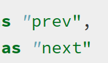
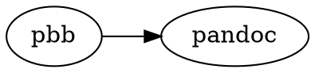
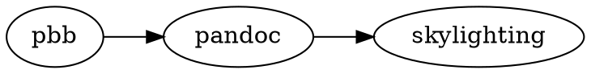
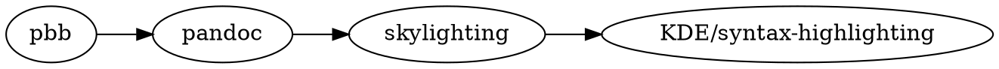
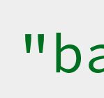

# Fixing pandoc PostgreSQL quote syntax highlighting

My open source contributions certainly deserve the label "minor". I mostly fix
typos when I see them and it's not too much work; one time, I added new
keywords introduced in Readline 7.0 to the Vim syntax file for Readline because
it bothered me that some of my `.inputrc` wasn't highlighted properly. Which
has the fun side effect that my GitHub user name now floats around in the [Vim
GitHub repo][vimgh] (and on many, many machines in
`/usr/share/vim/vimXX/syntax/readline.vim`). Fame!

  [vimgh]: https://github.com/vim/vim/blob/91f84f6e11cd879d43d651c0903d85bff95f0716/runtime/syntax/readline.vim#L5-L7

Also, one day, I'll get around to adding the Readline 8.0 keywords. One day.

Eventually, and mostly (okay, completely) by accident, I started specializing
in quotes. I noticed a misplaced "smart" quote in an article on the Go blog and
[fixed it], which later allowed me to say at a Go meetup that I "contributed to Go".

  [fixed it]: https://github.com/golang/blog/pull/26/files


My latest encounter with quotes and open source was shortly after I'd finished
my [summary of *The Art of PostgreSQL*][taop]. Pandoc supports an extensive
list of languages for code block syntax highlighting, and the code blocks in
that article all use `sqlpostgresql`.

  [taop]: 2020-04-05-taop-summary.html

Something was off, though: opening double quotes looked odd!



I opened an [issue] for myself so I wouldn't forget, and let it sit for a
month.

  [issue]: https://github.com/bewuethr/pandoc-bash-blog/issues/26

Eventually, I had a closer look. The HTML for the highlighted code looked something like

```html
<span class="co">&quot;</span><span class="ot">prev&quot;</span>
```

where `co` refers to a comment, and `ot` is for "other". The opening double
quote was weirdly designated a comment.

Now, pbb uses pandoc to produce its output. I should probably illustrate that
with a [dot graph]...

  [dot graph]: 2020-06-29-pbb-dot-graphs.html



Accordingly, I opened an issue in pandoc. But, as it turns out, pandoc uses a separate tool for syntax highlighting: [skylighting], by the same author, John MacFarlane.

  [skylighting]: https://github.com/jgm/skylighting



Accordingly, John moved my [issue][slissue] to skylighting, and also
immediately pointed out the likely culprit. Skylighting uses KDE XML syntax
highlighting descriptions:

  [slissue]: https://github.com/jgm/skylighting/issues/95



The syntax file for PostgreSQL contained this line:

```html
<DetectChar attribute="Comment" context="Identifier" char="&quot;"/>
```

And even without knowing much about how these syntax files work, this looked
suspicious. John suggested I'd submit a bug report to the KDE project, as
skylighting from time to time pulls the latest syntax files from upstream, and
he wants to avoid getting out of sync.

I dug happily into how a bug report should be filed for the KDE project and
eventually [submitted one][kdebug]. And since the fix was likely to be trivial,
I read up on [syntax highlighting for KatePart][shdocs] (where KatePart is the
"text editor component" used by QT and KDE applications).

  [kdebug]: https://bugs.kde.org/show_bug.cgi?id=421445
  [shdocs]: https://docs.kde.org/stable5/en/applications/katepart/highlight.html

Today, [KDE syntax highlighting][kdesh][^1] is its own project. Until 2016, the
syntax definitions were part of the [KTextEditor project], and before that,
until 2014, they were in [Kate].

  [kdesh]: https://github.com/KDE/syntax-highlighting
  [ktexteditor project]: https://github.com/KDE/ktexteditor
  [kate]: https://github.com/KDE/kate

  [^1]: KDE is currently migrating from a [Phabricator
  instance](https://phabricator.kde.org/) to
  [GitLab](https://invent.kde.org/public/), but I'll link to GitHub mirrors
  because I'm more familiar with navigation there.

I think a clarifying dot graph is in order[^2], this time to illustrate the
migration of KDE syntax highlighting:

  [^2]: Or maybe I just want to use my new feature.


The PostgreSQL syntax file was added in 2002, in [this commit][pgkatecommit],
and the line for double quotes looked like this:

  [pgkatecommit]: https://github.com/KDE/kate/commit/8eb69d93e3a0bee856f9d404bd8de395c6bfca76#diff-23999c6941df50d23a602798ad93d229

```html
<DetectChar attribute="9" context="5" char="&quot;"/>
```

where `attribute` and `context` are indices into arrays: both attribute 9 and
context 5 are for "identifiers".

Then, in 2003, somebody [cleaned up] the highlighting definitions and modified
the line incorrectly to use `attribute="Comment"`. Ever since then, opening
double quotes have been highlighted as comments around the globe.

  [cleaned up]: https://github.com/KDE/kate/commit/2e55bd0ca7deaaffe5546f04e2925112cca2a9a6#diff-23999c6941df50d23a602798ad93d229

The [fix] was really just to replace `"Comment"` with `"Identifier"` on that
line. John suggested I'd submit a [patch] to skylighting with the fix, which
would be used in the build process, until the upstream fix landed.

  [fix]: https://phabricator.kde.org/D29735
  [patch]: https://github.com/jgm/skylighting/pull/97

Now it was just about waiting:

- The KDE Syntax Highlighting fix was part of [v5.71.0], released on June 13
- Skylighting added the fix in [0.8.5], released on June 19; this actually
  included updating the syntax files from upstream, so my patch never made it
  into a release---but John kindly credits me in the [release notes]
- Pandoc itself uses skylighting 0.8.5 in release [2.10] from June 30

  [v5.71.0]: https://github.com/KDE/syntax-highlighting/releases/tag/v5.71.0
  [0.8.5]: https://github.com/jgm/skylighting/releases/tag/0.8.5
  [release notes]: https://github.com/jgm/skylighting/blob/0.8.5/changelog.md#085
  [2.10]: https://github.com/jgm/pandoc/releases/tag/2.10

And behold:

```sqlpostgresql
select 'foo' "bar";
```



I imagine this is going to make a fundamental difference in the lives of many
people.

Fine, it won't---but it was fun diving into this obscure bit of syntax
highlighting history, and I really appreciated how friendly I was treated by
all the open source maintainers I interacted with.
