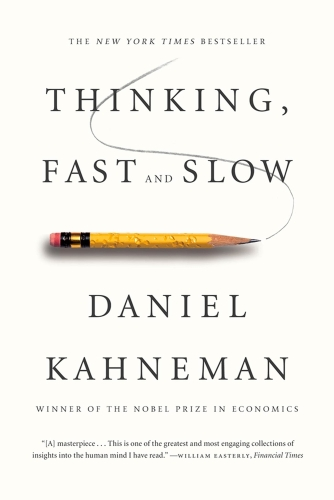

---
toc: true
...

# My takeaways from "Thinking, Fast and Slow"

We've recently read [*Thinking, Fast and Slow*][tfas] in the book club at work.
The book took its toll in the form of everybody except three people giving up
sooner or later, and I'll admit that I found it hard work to get through: I'd
have to highlight while reading, and then write a short summary for each
chapter, or everything would be a total blur after a few weeks.

  [tfas]: https://us.macmillan.com/books/9780374533557

I'm not going to summarize the book---there are a *lot* of summaries out there
already---and I'm not really going to review it (see [Goodreads] for more than
9000 reviews in English alone). Instead, I want to summarize my concrete
takeaways.

  [Goodreads]: https://www.goodreads.com/book/show/11468377-thinking-fast-and-slow

## Make people clean their dishes

Chapter 4 ("The Associative Machine") talks about an "honesty box" that was set
up in a university kitchen: people put money in it for the milk they took. Next
to the box was a picture, and the observation was that the amount left per
litre of milk increased when there was a poster with eyes on the wall (as
opposed to, say, flowers). The context is "priming".

At work, I'm sometimes annoyed when people leave their dirty dishes in the sink
(or I used to be, before working from home full-time). I always wanted to put
up a picture of a security camera as a tongue-in-cheek reminder, and the
experiment seems to confirm that this kind of thing would actually have a
measurable impact.

The takeaway would be actually putting up such a picture; I'll revisit next
year, I guess!

## Avoid biasing each other

In Chapter 7 ("A Machine for Jumping to Conclusions"), the *Halo effect* is
discussed; an example is judging essays, where the quality of the first essay
by a student would affect how the second one would be judged. Kahneman
describes how he adopted a new procedure where he'd judge all first answers,
then all second answers, and made sure to not see how the first one was graded
when looking at the second one.

A side effect of this was feeling less confident about the grading.

My takeaway: when soliciting ideas in a meeting or discussing a candidate after
an interview, everybody should write down what they want to say first;
otherwise, the first statement is going to bias all others.

## You don't know what you don't see

Chapter 12 ("The Science of Availability") has an example where couples were
asked how much they think they contribute to doing household chores, and the
answers always summed up to more than 100% per couple.

I know of 100% of the instances where I did something (because I was there),
but I'm going to miss work others did---I shouldn't assume it didn't happen
just because I'm not aware of it.

## Interview with simple checklists

People are poor judges when evaluating complex information; as per Chapter 21
("Intuition vs. Formulas"), simple algorithms perform better than experts.
There are great examples with an algorithm that predicts wine prices based on a
few weather inputs, and the Apgar test to assess if the breathing of a newborn
should be considered normal or not.

Applied to interviews, the recommendation is to use a list of qualities desired
in a candidate with associated questions each, and the interviewer should more
or less just go through these questions. If the interviewer does *not* make the
final decision on hire / no hire, they can be allowed to add a summary
judgment, which can be given quite some weight; if they make the decision,
they should only use the list of questions.

## Use premortems to counter the planning fallacy

People overestimate how good they are at something something because they
substitute that assessment by how comfortable they feel doing it; this results
in everybody thinking they're an above average driver, or many movie releases
falling on the same weekend (Chapter 24, "The Engine of Capitalism").

Optimism can help with resilience, and in some cases, falsehoods are preferred
to honest uncertainties (from a doctor, for example); it can also lead to
entrepreneurs continuing their efforts even when they have been told reliably
that their chances are bad.

The *premortem* is a method to remedy the planning fallacy somewhat: when close
to a decision, people should describe how, one year in the future, the plan
completely and utterly failed. This can overcome groupthink, legitimize doubt
and uncover threats.

## Take a broad view on gambles

When faced with a gamble, people tend to prefer a guaranteed gain of less than
the expected value over the risk of not getting anything at all (Chapter 31,
"Risk Policies").

Instead, one should prefer the gamble if the expected value is higher---over
the course of many gambles, they'll approximate their expected values. The
gambles should satisfy these conditions:

- gambles are independent
- a loss wouldn't make me worry about my total wealth
- bets aren't long shots

A concrete application of this is checking one's investments infrequently, for
example just once a quarter.

## Honourable mentions

I found a few more parts very interesting, but couldn't translate them to
something concrete enough to be considered a "takeaway".

### Losses loom larger than gains

This is discussed in Chapter 26 ("Prospect Theory"); the fear of losing \$100 is
stronger than the hope of gaining \$150. A takeaway could be that if you want
somebody to want something, instead of telling them how great the thing is, you
give it to them and then take it away again--like a car salesperson letting you
test drive a car all by yourself.

### The peak-end rule

How something is remembered is dominated by its most extreme moment and its end
(Chapter 35, "Two Selves"). An example is how pain is remembered: longer
duration of the pain overall is preferable to shorter with a painful end.

And there you have it! Six concrete things to actually do.
