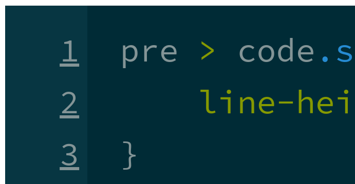
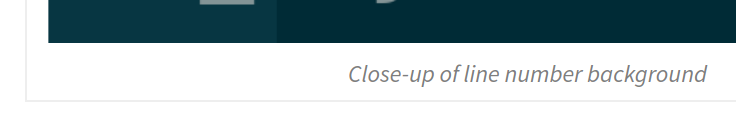
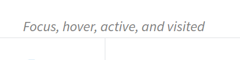
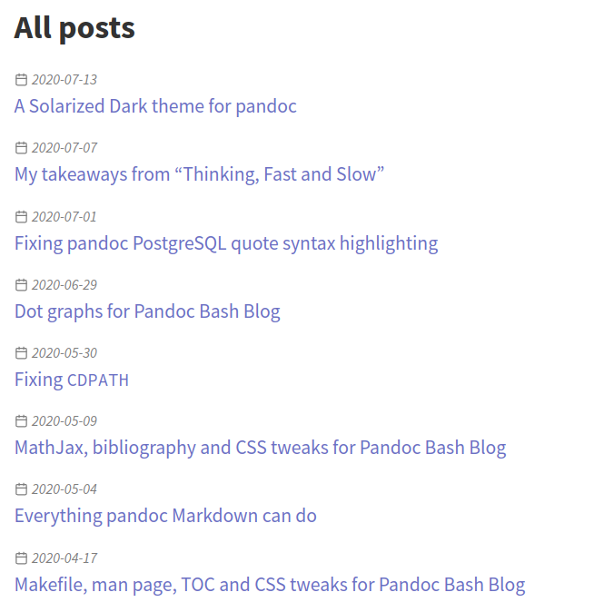
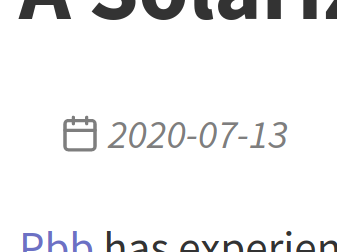

# A Solarized Dark theme for pandoc

[Pbb] has experienced a few upgrades recently.

  [pbb]: https://github.com/bewuethr/pandoc-bash-blog

## Solarized Dark syntax highlighting

The most visible change is a custom theme for code block syntax highlighting;
it now uses [Solarized] Dark, my preferred colour theme for pretty much
everything. I've found a useful [guide to skylighting JSON themes][guide], and
after lots of trial and error to see which token type was what, I've arrived at
a result I'm happy with.

Halfway through, I realized that the KDE syntax highlighting project already
does contain a Solarized Dark theme, but it includes a few Kate specific
settings that I don't need for pandoc, and it uses a few colours differently
from what I want---so I didn't mind having created my own.

The biggest challenge was to get the CSS for the background of line numbers
right; something like

```{.css .numberLines}
pre > code.sourceCode > span > a:first-child::before {
    line-height: 1.6em;
}

pre > code.sourceCode > span:first-child > a:first-child::before {
    margin-top: -9px;
    padding-top: 9px;
}

pre > code.sourceCode > span:last-child > a:first-child::before {
    margin-bottom: -9px;
    padding-bottom: 9px;
}
```

finally did the trick. Notice that when this scrolls horizontally, there is
still an issue with extra padding at the end of each line. This is
self-illustrating, but here's a picture in case the styling ever changes:



The theme file is in the [pbb repo on GitHub][themefile].

  [solarized]: https://ethanschoonover.com/solarized/
  [guide]: https://github.com/tajmone/pandoc-goodies/tree/master/skylighting/themes
  [themefile]: https://github.com/bewuethr/pandoc-bash-blog/blob/e187bfc92af76cc31070ba3500ce05f67675bef1/pandoc/solarizeddark.theme

## Link styling

Links now behave differently on focus, hover and when active: there is a drop
shadow, which becomes increasingly less blurry and moves around a little.

+-----------------------------------------+-------------------------------------------+
|    |      |
+-----------------------------------------+-------------------------------------------+
|  |  |
+-----------------------------------------+-------------------------------------------+

Table: Focus, hover, active, and visited

The colours are also taken from the Solarized palette. (Just like `inline
code`, by the way.)

## Figure styling

Figure captions are now different from normal text, and figures got a little
border:



## Table captions

Table captions got the same treatment:



## Index page and datestamps

The index page got a new look with bigger post titles and styled datestamps:



And the datestamp on each post as well:



This uses a [Feather] icon for the calendar.

  [feather]: https://feathericons.com/

## Dependabot for GitHub Actions

This is more of a behind-the-scenes change: there is now support for
[Dependabot] to update Actions workflows (see [blog post] and [help page]),
which I have enabled. Not because I have super complex workflows, more to see
how it works.

  [dependabot]: https://dependabot.com/
  [blog post]: https://github.blog/2020-06-25-dependabot-now-updates-your-actions-workflows/
  [help page]: https://docs.github.com/en/github/administering-a-repository/keeping-your-actions-up-to-date-with-github-dependabot
