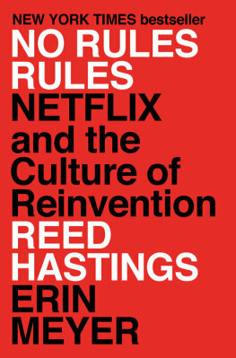

---
toc: true
...

# Does "No Rules Rules" rule?

[*No Rules Rules*][nrr] was book number eleven for our book club at work. We
had previously read [*Powerful*] by Patty McCord, so many concepts weren't new,
but it was an interesting new perspective.

Overall, it was a bit of a roller coaster of changing opinions for me.

[nrr]: <https://www.penguinrandomhouse.com/books/606529/no-rules-rules-by-reed-hastings-and-erin-meyer/>
[*Powerful*]: <https://pattymccord.com/book/>

## Is this whole thing a non-starter?

- Everything hinges on you only having the best people, which for Netflix
  happened when they had to let go of a lot of people, which makes the whole
  thing a bit of a non-starter
- "Bad apple" example is also reference in Culture Code

## Does this even apply to us?

- Does this even apply to us? The authors point out that "No Rules" is great
  for creative companies, but not so much for critical stuff like finances
- Who are they to talk? Is Netflix even that great? There's this study showing
  by far the highest happiness for Netflix employees compared to other big tech
  firms; survivor bias? How was the study conducted? And does all of this apply
  to Netflix Engineering as well?

## A few dislikes

- Some of the examples with people for whom the Netflix Way didn't work end
  without a conclusion, or just with "doesn't work here any longer"; they also
  felt stilted at times
- Keeper Test: sounds horrible, but maybe people are okay with it because they
  are very likely to get a good job elsewhere quickly?
- Chapter 10: worst of the worst, the classic "ignorant American" fully
  confirmed; however, schematics to "measure" culture were pretty cool

## Things I'd be happy to see adopted

- Things I feel are definitely a good idea to adopt:
  - Vacation policy (acknowledging that the actual effect is small, but it's a
    nice sign of trust)
  - Expense policy
  - No unnecessary red tape for things like expenses; trust, and check
  - Open and transparent as the default
  - Giving feedback and encouraging it (but most definitely not the Live 360s);
    live "Only say about someone what you will say to their face."; use
    belonging cues when receiving feedback (also Culture Code); 4A guidelines
  - Leading with context
