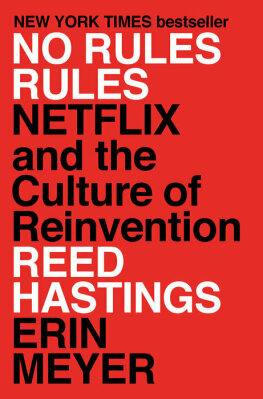
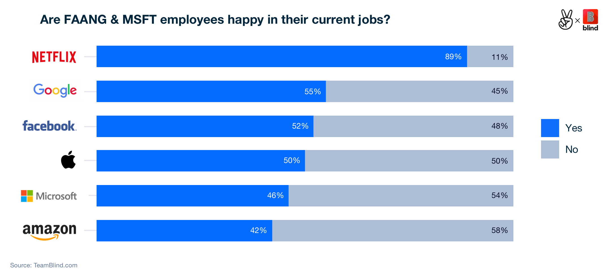

---
toc: true
link-citations: true
references:
  - id: Felps2006
    type: article-journal
    author:
      - family: Felps
        given: Will
      - family: Mitchell
        given: Terence
      - family: Byington
        given: Eliza
    issued:
      - year: 2006
        month: 12
    title: 'How, when, and why bad apples spoil the barrel: Negative group
      members and dysfunctional groups'
    title-short: How, when, and why bad apples spoil the barrel
    container-title: Research in Organizational Behavior - RES ORGAN BEH
    page: 175-222
    volume: '27'
    DOI: 10.1016/S0191-3085(06)27005-9
  - id: Sackman1968
    type: article-journal
    author:
      - family: Sackman
        given: H.
      - family: Erikson
        given: W. J.
      - family: Grant
        given: E. E.
    issued:
      - year: 1968
        month: 1
    title: Exploratory experimental studies comparing online and offline
      programming performance
    container-title: Commun. ACM
    publisher: Association for Computing Machinery
    publisher-place: New York, NY, USA
    page: 3-11
    volume: '11'
    issue: '1'
    keyword: programmer trainee performance, factor analysis application,
      online vs.  offline performance, programmer/computer communication,
      analysis of variance, programming cost effectiveness, basic programming
      knowledge test, programming experimental-empirical studies, debugging
      effectiveness, programming performance, experienced programmer study,
      time sharing vs. batch processing, programmer individual differences
    URL: https://doi.org/10.1145/362851.362858
    DOI: 10.1145/362851.362858
    ISSN: 0001-0782
...

# Does "No Rules Rules" rule?

[*No Rules Rules*][nrr] was book number eleven for our book club at work. We
had previously read [*Powerful*] by Patty McCord, so many concepts weren't new,
but it was an interesting new perspective.

Overall, how I felt about the book was a bit of an emotional roller coaster.

[nrr]: <https://www.penguinrandomhouse.com/books/606529/no-rules-rules-by-reed-hastings-and-erin-meyer/>
[*Powerful*]: <https://pattymccord.com/book/>

## Is this whole thing a non-starter?

The whole book is laid out as a sequence of quite specific steps a company can
take to become like Netflix, by

- building up talent density,
- increasing candor,
- and releasing controls.

Each dimension then is iterated over three times. The first step, and a
precondition for all the rest, is to have high "talent density", i.e., only
have really high performers working at the company. For Netflix, this kind of
happened when they had to lay off a third of their workforce in 2001:
executives realized that everything was suddenly better because all the "just
adequately" performing employees were gone.

Well, what if your company happens to not go through an existential crisis? How
do you identify and get rid of all the non-stellar employees in a way that
doesn't cause (justified) outrage? Is this even possible for an already
established company? I couldn't find an answer to this, and seeing that all
other steps require this high talent density, it felt like the rest of the book
might be difficult to apply.

I did like the reference to the "bad apple" study [@Felps2006], though, seeing
that it was also mentioned in [*The Culture Code*][tcc]: a single
underperforming (or actively disruptive) team member pulls down the performance
of the whole team significantly. In *The Culture Code*, the focus was on how
there can be "good apples" to counteract this; in NRR, the emphasis is on the
negative effects and eliminating them.

Another great reference introduced me to the origins of the mythical "10x
engineer": a paper from the 60s describes how programmers were given
standardized tasks and how vast the performance differences between individuals
were [@Sackman1968]. I'm not convinced that this should be taken at face value
for engineers 50 years later, though.

[tcc]: <2020-09-06-culture-code-takeaways.html>

## Does this even apply to us?

On a related note, the authors point out multiple times that the model they
describe isn't applicable everywhere. It's great for creative endeavours where
failure isn't critical, but probably shouldn't be used when you want to
produce "a million doses of penicillin" or "ten thousand identical cars".

Now, software engineers fancy their craft as somewhat creative at times---can
the model be applied here? My guess is that it still depends: are you writing
software to control a nuclear submarine, or to stream cartoons? What about an
app for personal banking?

I don't recall the book using any examples involving Netflix engineers, so it's
not obvious if the same principles are applied also for engineers, or if
engineering is somehow treated differently as "not all that creative". 

There are surveys comparing employee happiness among FAANG (and MSFT) workers
such as [this one][angel] conducted by AngelList and Blind in October 2019:

Or a [similar survey][blind] from November 2020, this time by Blind alone,
where Netflix tops every single category. There are of course valid questions
such as "how was this measured?", "this is all self-reported, survivor bias
much?", or "what about significant differences between engineering and the rest
of a company?", but it's at least *some* evidence that Netflix seems to be
doing alright as an employer.

[angel]: <https://angel.co/blog/over-60-of-employees-are-happy-at-startups-far-outpacing-faang-and-msft>
[blind]: <https://www.teamblind.com/blog/index.php/2020/11/17/which-faang-is-best-to-work-for-we-figured-it-out/>

## A few dislikes

While overall I felt the time spent reading the book was a good investment, I
didn't exactly nod in agreement with every single section.

Some of the examples talk about people for whom the culture wasn't a good fit,
like "Michelle" and her problematic "business" trips to Las Vegas with
suspiciously high food and drink expenses (which got her fired). To me, these
examples felt very contrived and eroded my trust into the authenticity of the
examples for things working out fine---but to be fair, many of the latter use
full names of high profile Netflix employees. There also didn't seem to be much
in terms of helping people adapt to such a culture; apparently, you're either a
fit or you are not.

Reading about the Keeper Test ^[Would my manager fight to keep me if I told
them I want to leave? If no, they should have let me go already.], I couldn't
help but being slightly horrified at the thought of having this kind of
pressure looming over me. The examples of people having trouble to adjust to it
didn't exactly help, either: what happened to Marta, who moved from Spain to
the Netherlands, and had trouble breathing in the elevator every single morning
from all the stress? I need closure! Since her full name was given, I kind of
expected to read about a marvellous transformation, but for all I know, she
still suffers from anxiety every day. (But she still works at Netflix, I
checked!)

Chapter 10 talks about scaling Netflix culture globally. There are a few neat
ideas, like a culture map of the company and anticipating regional challenges
for strong deviations in certain dimensions: "communication in Japan is a lot
more high-context than at Netflix, we should probably take that into
consideration when working there."

The rest of the chapter, however, read a bit like people realizing for the
first time in their lives that the world consists of more than just the United
States, and then applying that knowledge by means of a cultural clichée hammer:
"the Dutch do X, the Japanese do Y"---I feel like there's more nuance to it.

My overall impression oscillated between "this all makes so much sense" and "of
course they think it's great, it's their company, but it sounds like a cult".

## Things I'd be happy to see adopted

I concluded that it's unlikely for any company I work at to ever undergo the
complete "Netflixification", but there are a few key points I'm taking away as
useful on their own.

- **A policy of not just unlimited "personal time off" days, but unlimited
  holidays.** Multiple references indicate that people take about the same
  amount of time off as they would with limited holidays, but it would be more
  flexible, and signal trust in employees.
- **No expense policy.** At Netflix, the entire policy is

  > Act in Netflix's best interest

  (and if you abuse it, you're fired). This might be too extreme for many
  companies, but there probably is some middle ground between "every expensed
  pencil goes through a five-tier approval process" and "there is no approval
  process".
- **Defaulting to public visibility.** With very few exceptions for things that
  are personal, everything (meeting notes, strategy docs, roadmaps and so on)
  should be accessible by everybody. I don't see any benefit to selectively
  withholding information, and having the information provides context.
- **Actually giving and encouraging feedback.** I'm pretty sure every company
  ever says that personal growth and feedback are very important to them;
  actually living that is another story. I want to point out the "Live 360s"
  from the book as going way too far for my taste, though---but "Only say about
  someone what you will say to their face" sounds like a solid principle. And
  the "4A" guidelines for providers and recipients of feedback (aim to assist,
  actionable, appreciate, accept or discard) feel useful as well.
- **Leading with context.** Understanding why you're doing something is always
  going to get better results than being an implementation robot.

Overall, I wouldn't say that *No Rules Rules* rules indiscriminately, but there
are certainly a few interesting ideas in there, and it's an entertaining read.
