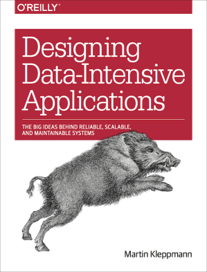

# Book review: Designing Data-Intensive Applications

After kicking off our technical book club at work over a year ago with *The Art
of PostgreSQL* (see my [review] and [summary]), we took almost half a year of a
hiatus before deciding to tackle another book---but in August, we decided to
give [*Designing Data-Intensive Applications*][ddia] (DDIA) by Martin Kleppmann
a go.



We "worked" on the book from August until December, and it was not exactly a
breeze to read; I don't think anybody regretted the time spent on reading and
discussing, though.

[review]:  <2020-03-29-taop-review.html>
[summary]: <2020-04-05-taop-summary.html>
[ddia]:    <https://dataintensive.net/>

## Quality

This is not a short book by any standard, and a few typos in such a dense text
would certainly be forgivable. However, I don't remember seeing any at all.
This book has been around for a few years, and the [errata] aren't
non-existent, but whatever process there is in place to fix typos resulted in
the version I ended up reading being near-perfect.^[My version was the Kindle
version, which has been getting regular updates every few months, with the
latest release in June 2020.]

The level of care is exceptional also elsewhere. A pet peeve of mine are
technical books with shell script snippets full of outdated and bad practices,
as if it didn't matter; I appreciate it all the more when an author cares about
these little things as well. (And can you trust somebody who doesn't quote
their variables? Surely not.)

There are several examples where concepts are explained using simple shell
implementations, for example the "world's simplest database":

```bash
db_set () {
    echo "$1,$2" >> database
}

db_get () {
    grep "^$1," database | sed -e "s/^$1,//" | tail -n 1
}
```

Everything neatly quoted, no [Useless Use of Cat][uuoc], no ugly (and [not even
POSIX compliant][posix]) `tail -1`... perfect.

[errata]: <https://www.oreilly.com/catalog/errata.csp?isbn=0636920032175>
[uuoc]:   <http://porkmail.org/era/unix/award.html>
[posix]:  <https://pubs.opengroup.org/onlinepubs/9699919799/utilities/tail.html#tag_20_125_18>

## The maps

Each chapter starts with a beautiful map with locations named after the
material introduced in the chapter. Kleppmann wrote a [blog post][blog] about
this where he explains that the regions stand for the concepts, and the cities
are specific implementations. There was even a Kickstarter campaign for
[posters] with all the maps!

I enjoyed looking at the maps before reading, seeing some terms I'd heard
before and some I had no clue what they meant---and then coming back to the map
after reading, and understanding why things are grouped together and what the
concepts behind the names are.

[blog]:    <https://martin.kleppmann.com/2017/03/15/map-distributed-data-systems.html>
[posters]: <https://dataintensive.net/poster.html>

## The references

Throughout each chapter, a ton of references are listed (about one hundred per
chapter), so if I'm more interested in any topic (just because, or maybe
because I'm working on a related problem), there's no shortage of material to
dive deeper. Almost every reference links to the source, and Kleppmann
maintains a [Git repository][ddia-references]^[Bonus: there's a PDF with a
high-resolution version of all the maps!] with updated links. (Now, if he would
only merge my pull request with a fix...)

[ddia-references]: <https://github.com/ept/ddia-references>

## My main takeaways

Reading this often felt like studying for a university exam: I would read and
highlight, then go through the chapter again and write a summary for it. That's
of course not required, but I feel like I'm retaining much better like this.
(If only I would have enjoyed studying as much when it would have been more
useful!)

The book covered a lot I only have passing familiarity with (such as
non-relational datastores), barely even knew existed (for example leaderless
replication), or just took for granted without knowing how it works (like
indexing). If I need to know more about a topic, I now know where to start.

For some concepts, I realized how incomplete my understanding had been
(example: ACID and isolation levels), and I'm now at least aware of that. Know
what you don't know!

And, almost the biggest win for me, a lot more problems I encounter or read
about every day make a lot more sense now: I have a better idea what approaches
and tradeoffs there are, or at the very least I remember that I *should* know
what something is about---and then I can go look it up. ~~I can also drop more
buzzwords in interviews now, which always impresses everybody involved.~~

All in all, the book deserves all the praise it gets, and I can't imagine
anybody buying and reading it ending up thinking that either money or time was
wasted.
