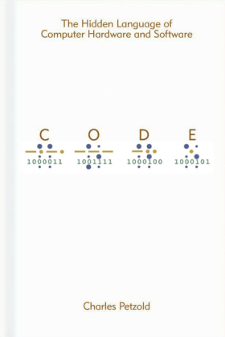

# An ode to "Code"

[*Code*][code] by Charles Petzold was the third title we tackled in our "technical book
club" at work. After [*Designing Data-Intensive Applications*][ddia], the idea
was to pick something a little more easily digestible---plus, *Code* had been
on my list for quite a while, so I was more than happy with the choice.

[code]: <https://www.charlespetzold.com/code/>
[ddia]: <2021-02-02-ddia-review.html>

Throughout reading, I had the impression that this was written by somebody who
is *so passionate* about a topic that they want everybody else to be able to
understand and appreciate said topic. The book aims to be understandable by
everybody, regardless of any background in computing, and I think it probably
achieves that goal---but I suspect somebody truly unfamiliar with everything
covered would have to put in a substantial amount of work while reading.

Going through the book was a very pleasant experience. There was barely a
chapter where I didn't either 

- learn how something I've seen a million times *really* works (like bar
  codes), or
- find something familiar explained in a much better way than I've ever seen
  before (such as two's complement, or floating point rounding errors), or
- build an understanding of something I only had a fuzzy idea about (like how a
  CPU works).

In other words: many, many "A-ha!" moments.

Not too long ago, I've read [*The Idea Factory*][tif] about the history of Bell
Labs, so the whole build-up around telegraphs and relays was a nice recap of
the early parts of that book.

I particularly liked the relay computer with all the "selective lying" (or
maybe just "omissions") for pedagogic reasons: for example, Petzold shows how
to build memory using relays, based on circuitry previously introduced---only
to reveal in the end that that would be entirely unpractical to actually do.
But the principles carry over without a problem when using transistors instead
of relays, so all the understanding gained until the reveal is not lost.

[tif]: <http://jongertner.net/the-idea-factory/>

## Relay computer inspiration

The part about the popular microchips and their instruction sets had me dig
through manuals online, and I can only imagine how much fun it must have been
to tinker with that stuff at the time. In fact, being inspired to do something
hands-on based on the book was a very common theme among the participants in
the book club.

While researching a bit more about relay computers, I've found that a few
people have built amazing machines and produced excellent documentation for
them:

- [Harry Porter's relay computer][porter] seem to be the classic in the field
- The [RC-3 relay computer][rc3] is a refined and more compact version of Porter's machine
- Paul Law writes about his take on the Porter design on his [blog][plaw]; he
  has produced an excellent [video series][plawpl] describing his machine in
  great detail
- Clickety Clack's relay computer as showcased in [this playlist][clicla] is
  directly inspired by *Code* and makes a great complement to the book
- Ben Eater has a ton of videos very close to the subject matter in *Code*; the
  [series describing how to build an 8-bit CPU][benepl] comes with a [companion
  website][bene8bit], and you can even buy complete [kits][benekit] and start
  breadboarding! Once we can have in-person office days again, I'd love to
  start a weekly meetup where people work on this.

[porter]:    <http://web.cecs.pdx.edu/~harry/Relay/>
[portervid]: <https://youtu.be/9WdclMAs55w>
[rc3]:       <http://www.computerculture.org/projects/rc3/>
[plaw]:      <https://relaycomputer.co.uk/>
[plawpl]:    <https://www.youtube.com/playlist?list=PLLACadYlrOka4N5IEfm1cmSuf39ZQSQst>
[clicla]:    <https://www.youtube.com/playlist?list=PL_1HsIiuOfg3QA91DUd9kGJjQoOHwlt5Q>
[benepl]:    <https://www.youtube.com/playlist?list=PLowKtXNTBypGqImE405J2565dvjafglHU>
[bene8bit]:  <https://eater.net/8bit>
[benekit]:   <https://eater.net/8bit/kits>

## Takeaways

My main takeaway is the actual feeling of understanding how a computer works
from the bottom up. While the technology described doesn't get much more
sophisticated than what PCs did in the early 80s, the principles haven't
fundamentally changed and still make a good foundation when taking a closer
look at more recent developments. I often feel I get more out of what I read
because of *Code*: articles describing the architecture of the M1 CPU make a
lot more sense to me now, or reading about the boot sequence in the [sysadmin
tome][ulsah] I'm currently going through is much more understandable.

Apart from building physical stuff, I also feel like working with assembly code
might be interesting. Now to find a useful project to do just that!

And for follow-up reading, [*Computer Systems: A Programmer's
Perspective*][csapp] is often recommended as a more in-depth treatise.

[ulsah]: <https://admin.com/>
[csapp]: <https://csapp.cs.cmu.edu/>
