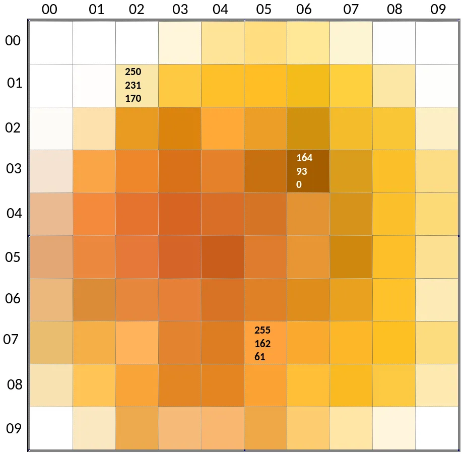

# Mounting an image as a filesystem

Last week, we had "Impossible Stuff Day" at the Recurse Center. It's a bit like
a one-day hackathon, with the main goal of trying to do something that's
definitely past the [edge of one's abilities][edge], and maybe adjust that edge
afterwards.

I set out to access an image as a filesystem. I'd seen similar projects:

- [TabFS] (mount browser tabs as a filesystem)
- [rssfs] (RSS reader as a filesystem)
- [ffs], the "file filesystem" (mount semi-structured data as a filesystem)

So it was obviously possible. The impossible (to me) aspect was a combination
of having a very fuzzy (at best) idea of where this would be implemented
(something something system calls), and having properly worked with C more than
ten years ago.

[edge]: <https://www.recurse.com/self-directives#work-at-the-edge>
[tabfs]: <https://omar.website/tabfs/>
[rssfs]: <https://github.com/dertuxmalwieder/rssfs>
[ffs]: <https://mgree.github.io/ffs/>

## Research

I hit the Recurse Center library so I could leaf through thick books instead of
turning my mouse wheel. After some quality time with [a][kerrisk]
[few][stevens] [classics][kernighan], I had a very rough idea: there is an
abstraction for common filesystem operations, the *virtual file system*[^1]
(VFS), and a filesystem has to implement that interface. *The Linux Programming
Interface* had a helpful diagram, roughly like this:

[^1]: Also, is it "filesystem" or "file system"? Authors don't agree with each
other, and I've changed it about three times already.

```{.dot .include-source}
graph {
  node [shape=box]
  vfs [label="Virtual File System (VFS)"]
  Application -- vfs
  vfs -- {ext2, ext3, Reiserfs, VFAT, NFS}
}
```

However, specifics about *what* exactly makes up the VFS were a bit more
difficult to come by. The Wikipedia page about VFS and a hint from a [fellow
Recurser][leo] eventually led me to [FUSE], "Filesystem in Userspace".

> **Filesystem in Userspace** (**FUSE**) is a software interface [...] that
> lets non-privileged users create their own file systems without editing
> kernel code.

 Phew :sweat_smile: No kernel hacking for me![^2]

[^2]: See? "Filesystem" and "file system", *in the same sentence* :unamused:

[kerrisk]: <https://man7.org/tlpi/>
[stevens]: <https://www.oreilly.com/library/view/advanced-programming-in/9780321638014/>
[kernighan]: <https://www.pearson.com/en-us/subject-catalog/p/unix-programming-environment-the/P200000000349/9780139376818>
[leo]: <https://leoshimo.com/>
[fuse]: <https://en.wikipedia.org/wiki/Filesystem_in_Userspace>

## FUSE implementations

To just see it in action, jump ahead to *[Usage Example]*.

There is a [reference implementation][libfuse] of FUSE, in the form of a chunky
C library. Apparently, there's sometimes a bit of confusion around FUSE the
interface and libfuse the implementation, with people referring to both as just
"FUSE"---but the important part is that maybe there's another implementation
that is more Benjamin-friendly!

At first, I found [Go bindings for libfuse][go-fuse], which already looked
better to my [Gopher] eyes. And a little later, a from-scratch implementation
in pure Go: [bazil.org/fuse][bazilfuse], via [this blog post][blog] describing
[`zipfs`], which mounts a ZIP archive as a filesystem. I started digging into
the code.

And this is how far I got on the day itself, so it really was impossible for
me! A few people demoed their most excellent projects: a web server in Zig as a
first Zig project; beginnings of a collaborative editor with video chat; a
[font that converts hex colours to RGB][hexagone]; building a neural network;
coming up with an image format from scratch; teaching the [Flipper
Zero][flipper] to understand more types of NFC tags...

[libfuse]: <https://github.com/libfuse/libfuse>
[go-fuse]: <https://github.com/hanwen/go-fuse>
[gopher]: <https://go.dev/blog/gopher>
[bazilfuse]: <https://github.com/bazil/fuse>
[blog]: <https://blog.gopheracademy.com/advent-2014/fuse-zipfs/>
[`zipfs`]: <https://github.com/bazil/zipfs>
[hexagone]: <https://eieio.games/nonsense/hexagone-converting-hex-to-rgb-with-a-font/>
[flipper]: <https://flipperzero.one/>

## Implementation and obstacles

I started modifying `zipfs`. My goal was to mount an image and expose it as a
directory tree, with the top-level directories representing rows of pixels,
containing directories representing individual pixels, and in those
directories, there should be files named `r`, `g`, and `b`, containing RGB
values scaled to 0--255. Something like this, for a 2-by-2 pixel image:

```none
.
├── row0
│   ├── col0
│   │   ├── b
│   │   ├── g
│   │   └── r
│   └── col1
│       ├── b
│       ├── g
│       └── r
└── row1
    ├── col0
    │   ├── b
    │   ├── g
    │   └── r
    └── col1
        ├── b
        ├── g
        └── r
```

bazil.org/fuse provides a very nice higher-level abstraction for a filesystem,
where you have to implement a few required interfaces, and then add more
capabilities via implementing more interfaces. The minimal set looks something
like

```go
type FS interface {
    Root() (Node, error)
}

type Node interface {
    Attr(ctx context.Context, attr *fuse.Attr) error
}
```

Directories and files both implement `Node`. To enable a directory to respond
to lookup requests, it also has to implement `NodeRequestLookuper`:

```go
type NodeRequestLookuper interface {
    Lookup(ctx context.Context, req *fuse.LookupRequest,
        resp *fuse.LookupResponse) (Node, error)
}
```

This is where we can "make up" whatever directory structure we want. We also
want directories to be able to handle requests corresponding to the `readdir`
system call, and return a slice of directory entries; this is done by
implementing `HandleReadDirAller`:

```go
type HandleReadDirAller interface {
    ReadDirAll(ctx context.Context) ([]fuse.Dirent, error)
}
```

Notice the super-strict adherence to the single-method interface Go naming
convention of just appending `-er`!

Lastly, so we can open files, they have to implement `NodeOpener`:

```go
type NodeOpener interface {
    Open(ctx context.Context, req *fuse.OpenRequest,
        resp *fuse.OpenResponse) (Handle, error)
}
```

and the returned handle has to implement `HandleReader` to actually retrieve
file contents:

```go
type HandleReader interface {
    Read(ctx context.Context, req *fuse.ReadRequest,
        resp *fuse.ReadResponse) error
}
```

All these combined are enough for a read-only filesystem.

The implementation reads the image into memory when mounting (error checks and
deferred close calls omitted):

```go
func mount(path, mountpoint string) error {
    reader, _ := os.Open(path)
    img, _, _ := image.Decode(reader)
    c, _ := fuse.Mount(mountpoint)
    filesys := &FS{img: img}

    return fs.Serve(c, filesys)
}
```

And from then on, we can look things up in the image abstraction. For example,
a `File` has a reference to the image, knows about its own name, and its pixel
coordinates:

```go
type File struct {
    img  image.Image
    name string
    x, y int
}
```

And when we `Open` a file, we access the colour value at those coordinates, and
return a handle with a readcloser on a string containing that value:

```go
func (f *File) Open(ctx context.Context, req *fuse.OpenRequest,
    resp *fuse.OpenResponse) (fs.Handle, error) {
    r, g, b, _ := f.img.At(f.x, f.y).RGBA()

    var val uint32

    switch f.name {
    case "r":
      val = r
    case "g":
      val = g
    case "b":
      val = b
    default:
      return nil, fmt.Errorf("invalid filename %q", f.name)
    }

    // Convert from 0..65535 to 0..255
    colStr := strconv.FormatUint(uint64(val>>8), 10) + "\n"

    return &FileHandle{
        r: io.NopCloser(strings.NewReader(colStr)),
    }, nil
}
```

It wasn't smooth sailing, though. For the longest time, all my filesystem did
was telling me `Input/output error` when trying to perform any operation on it
whatsoever. After a long, long, time I realized that my directory
implementation has to set the directory mode bit:

```go
func (d *Dir) Attr(ctx context.Context, a *fuse.Attr) error {
    a.Mode = iofs.ModeDir | 0755  // <-- This one!
    return nil
}
```

This was sufficient for most things to suddenly work!

The only other snag was all files for some reason being empty, even though all
methods were implemented. This one was way sillier because it has nothing to do
with domain knowledge. Instead, my `Read` method did this:

```go
func (fh *FileHandle) Read(ctx context.Context,
    req *fuse.ReadRequest, resp *fuse.ReadResponse) error {
    var val []byte
    _, err := fh.r.Read(val)

    resp.Data = val

    return err
}
```

As it turns out, the `io.Reader` interface

```go
type Reader interface {
    Read(p []byte) (n int, err error)
}
```

isn't magically adjusting the byte slice size for you (or allocating it), so if
you give it a nil slice, you get a nil slice back. The fix was as simple as

```diff
  func (fh *FileHandle) Read(ctx context.Context,
      req *fuse.ReadRequest, resp *fuse.ReadResponse) error {
-     var val []byte
+     val := make([]byte, req.Size)
      _, err := fh.r.Read(val)

      resp.Data = val

      return err
  }
```

The end results of all this is at [bewuethr/imgfs].

[bewuethr/imgfs]: <https://github.com/bewuethr/imgfs>

## Usage example

Let's mount this [blobtopus] as a filesystem:


Or rather, this 10x10-pixel version of it:



Coordinates for *x* increase from left to right, and for *y* from top to
bottom. Three pixels have their RGB values labelled, as retrieved with a colour
picker.

We create a mount directory, and then mount the image into it:

```bash
mkdir mnt
imgfs blobtopus.png mnt
```

imgfs supports PNG, JPEG, GIF, and WebP.[^3] `mnt` now contains one directory per
pixel row:

[^3]: I actually cheated a little here: I was using WebP for the example at
first, but since I'm ignoring transparency and the Go `image` package defaults
to pre-multiplying RGB values with transparency, things were off; I had to
remove all transparency first.

```bash
$ tree -L 1 mnt
mnt
├── row00
├── row01
├── row02
├── row03
├── row04
├── row05
├── row06
├── row07
├── row08
└── row09
```

And each of these contains ten pixel directories ("col" for "column"):

```bash
$ tree -L 1 mnt/row00
mnt/row00
├── col00
├── col01
├── col02
├── col03
├── col04
├── col05
├── col06
├── col07
├── col08
└── col09
```

And in each of those, there is one file per RGB component:

```bash
$ tree mnt/row00/col00
mnt/row00/col00
├── b
├── g
└── r
```

Now, let's check the labelled pixels! The pixel at *x*/*y* coordinate (02/01)
is in `row01/col02`.

```bash
$ head mnt/row01/col02/{r,g,b}  # Want: (250,231,170)
 ==> mnt/row01/col02/r <==
250

==> mnt/row01/col02/g <==
231

==> mnt/row01/col02/b <==
170
```

Looking good!

And the other two:

```bash
$ head mnt/row03/col06/{r,g,b}  # Want: (164,93,0)
==> mnt/row03/col06/r <==
164

==> mnt/row03/col06/g <==
93

==> mnt/row03/col06/b <==
0
$ head mnt/row07/col05/{r,g,b}  # Want: (255,162,61)
==> mnt/row07/col05/r <==
255

==> mnt/row07/col05/g <==
162

==> mnt/row07/col05/b <==
61
```

Ta-daah :partying_face:

[blobtopus]: <https://emoji.supply/kitchen/?%F0%9F%AA%84+%F0%9F%90%99=8wxe01>

## Learnings and further work

The one cool additional thing to do would be to make the filesystem writeable:
updating the colour value in a file would change the pixel on the actual image.
Updating the in-memory image representation would be straightforward, but
continually changing an on-disk image file probably less so; in-place changes
wouldn't work, so we'd have to create new images files and rename them.

I certainly learned quite a few things about filesystems and FUSE, but also
feel like I scratched just the surface. The full FUSE API is huge, and I've
implemented a fraction of it, using a very high-level abstraction, at that.

A meta-insight was that designating a chunk of time to doing something specific
makes it easy to get started (you start when everybody else starts), and the
whole thing being timeboxed resulted in intense focus on the problem, even when
not every second was exactly thrilling.

This was very noticeable when I decided to keep working on this a day later: I
made very little progress, found it difficult to focus, and got quite
frustrated. I didn't touch the project for the whole weekend, even though I
totally thought I would---and when I got back to it on Monday, things seemed to
fall into place quite easily.

In any case, I'm pretty happy I de-mystified "X as a filesystem" a bit for
myself, and maybe now also for others.
